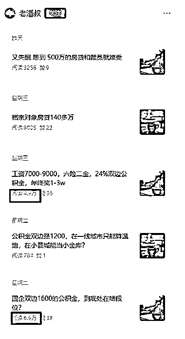
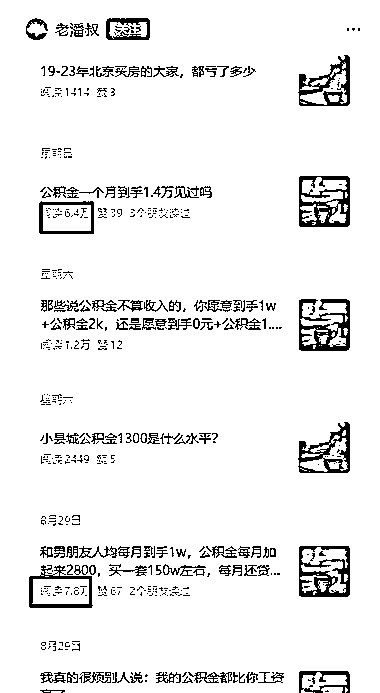
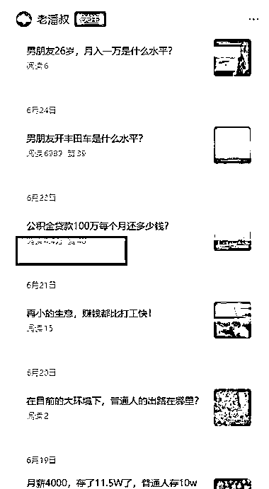

# 垂直小号机会：公积金内容流量稳定，一篇文章 4w+阅读量

> 原文：[`www.yuque.com/for_lazy/wind/hutl811qatvwvo3w`](https://www.yuque.com/for_lazy/wind/hutl811qatvwvo3w)

作者： 赵高明·多行

日期：2025-09-05

点赞数：**10**

* * *

正文：

垂直小号 【赛道方向】公积金
【案例描述】：5 月份开始更新的新号，6 月 23 日发了篇公积金相关文章，直接到 4.4w 阅读量，之后更新其他内容一直没流量。8 月中，彻底专注公积金方向，持续有流量。
【为什么是机会】： 公积金是持续有流量的方向，可以先赚流量主，同时优化内容，沉淀下私域，思考如何进行后端变现。

* * *

评论区：

礼新 : 谢谢分享

亦仁 : 感谢分享，已中标

* * *

公众号懒人搜索，[懒人专属群分享](https://lazybook.fun/#/blog/group)