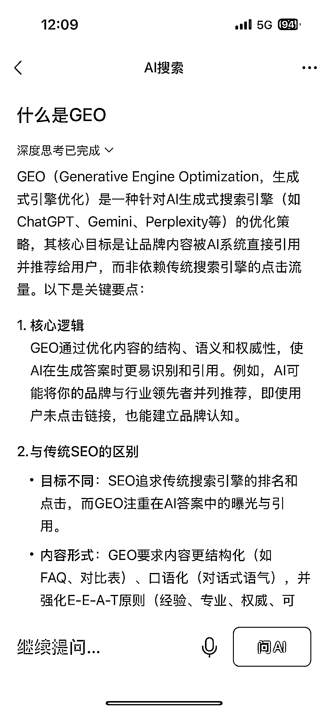

# 从 SEO 到 GEO，AI 时代的搜索优化新范式

> 原文：[`www.yuque.com/for_lazy/wind/cgk5alzlog241ieb`](https://www.yuque.com/for_lazy/wind/cgk5alzlog241ieb)

作者： 馆主

日期：2025-09-05

点赞数：**11**

* * *

正文：

风向标-平台新政策｜异常值 微信搜索入口灰度测试 AI 搜索，是时候尝试下 GEO ，特别是消费品品牌方，很容易落地
总结来说，GEO 是 AI 时代的搜索优化新范式，通过内容与 AI 逻辑的深度适配，实现“被引用”而非“被点击”的曝光目标。

* * *

评论区：

亦仁 : 感谢分享，已中标

* * *

公众号懒人搜索，[懒人专属群分享](https://lazybook.fun/#/blog/group)