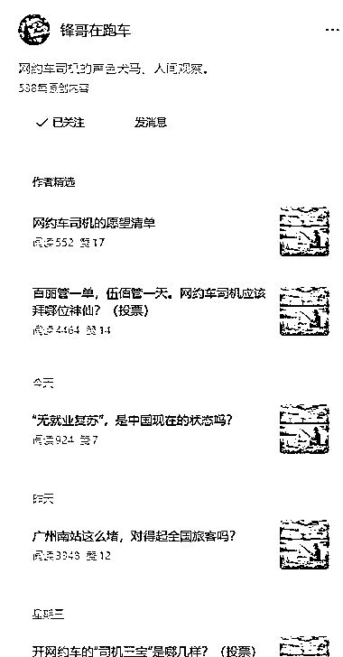
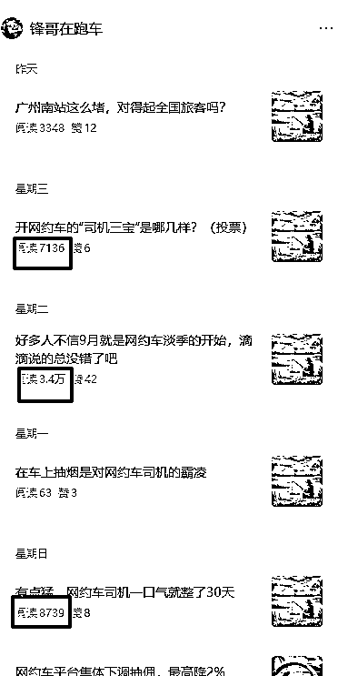
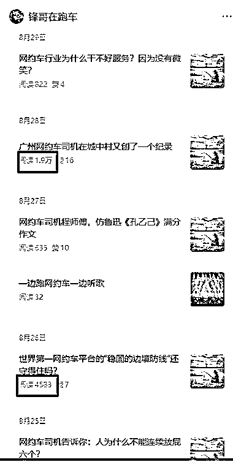

# 垂直小号：网约车司机观察，短文配图，浏览量普遍 4000+

> 原文：[`www.yuque.com/for_lazy/wind/mkigc6x0gy141r1f`](https://www.yuque.com/for_lazy/wind/mkigc6x0gy141r1f)

作者： 赵高明·多行

日期：2025-09-05

点赞数：**13**

* * *

正文：

垂直小号：网约车司机观察 ：「锋哥在跑车」定位在 ，通过日常观察、行业现象、热点评论来吸引读者。
有很不错的流量推荐。很多文章篇幅很短，就是一个标题，加几段叙述，穿插一些图片，但是阅读量很大，讨论热度高。 ： 网约车司机群体——
规模庞大、话题性强、故事资源丰富，差异化明显。 司机群体代表着很多普通人的缩影（打工、压力、奔波、希望），文章能引起广泛共鸣，读者代入感强。
网约车是城市生活的重要组成部分，涉及就业、出行、平台规则等话题，天然具备讨论度。 目前观察到的只有流量主。 后续方向：
1.广告：与出行相关的广告（车险、金融、培训、租车、兼职）； 2.社群：网约车司机经验交流社群； 3.知识付费：跑车攻略、司机省钱秘籍、兼职副业指南；
4.IP 塑造：从“司机故事”延伸到“城市观察”，打造社会性 IP。

* * *

评论区：

亦仁 : 感谢分享，已中标

发达 : 搞个号：老王在跑货拉拉。

* * *

公众号懒人搜索，[懒人专属群分享](https://lazybook.fun/#/blog/group)