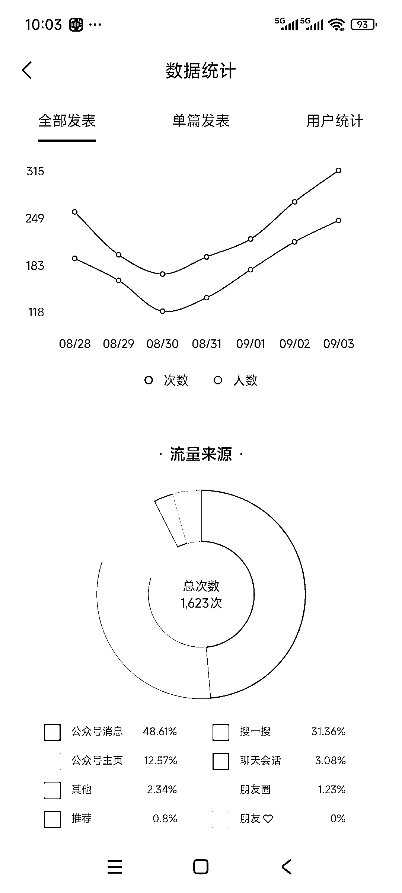

# 用头条关键词结合 AI 排新标题，文章搜一搜流量可观，达到了 70%的流量来源

> 原文：[`www.yuque.com/for_lazy/wind/uehhqt3bcqlctwpm`](https://www.yuque.com/for_lazy/wind/uehhqt3bcqlctwpm)

作者： Tony

日期：2025-09-04

点赞数：**31**

* * *

正文：

前段时间看到有大佬用微信广告关键词来提升文章排名，我是 5118 上导出了头条关键词排行，主要是没有微信的，头条凑合用一下。
我把写好的文章标题和关键词的 Excel 文件一起给到 AI 排出新的标题，感觉有点效果，有些文章的搜一搜可以达到 70%流量来源，如果文章够多，是不是每天吃搜一搜流量都可以了。

* * *

评论区：

亦仁 : 感谢分享，已中标

阿丽 : 大佬，具体如何导出

Tony : 闲鱼上去搜一次 5118 的专业版会员买一天的，导出头条，百度的关键词就好了就好了

* * *

公众号懒人搜索，[懒人专属群分享](https://lazybook.fun/#/blog/group)