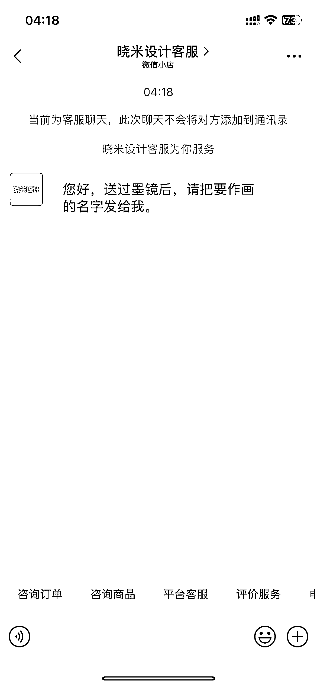

# AI 作画直播间：8000 人看，刷一个墨镜就能触发作画

> 原文：[`www.yuque.com/for_lazy/wind/hl6rvsu3gi73m3uu`](https://www.yuque.com/for_lazy/wind/hl6rvsu3gi73m3uu)

作者： 琳航

日期：2025-08-30

点赞数：**27**

* * *

正文：

深夜刷到这个直播间，流量很不错，8000 人看过，5000 多热度，看了几分钟，不断有人送墨镜🕶，评论区也不停有人问怎么做，然后主播引导后台私信名字，后台设置自动回复：刷一个墨镜发名字即可作画。
这种还挺好做，提前做好图片，做成视频在直播间循环播放就可以。提示词不难，用 ai 反推即可。 除了收礼物，还可以知识付费：卖这个 ai 作画教程，还可以收徒卖课。

* * *

评论区：

亦仁 : 感谢分享，已中标

琳航 : 谢谢佬大

晚晚 : 这个是人家做好打包卖的，某宝搜索一下就有。要哪个就直接搜索发给他们就好了，另外起号不好起

琳航 : 学习了[抱拳]

一登 : 好几年了

* * *

公众号懒人搜索，[懒人专属群分享](https://lazybook.fun/#/blog/group)