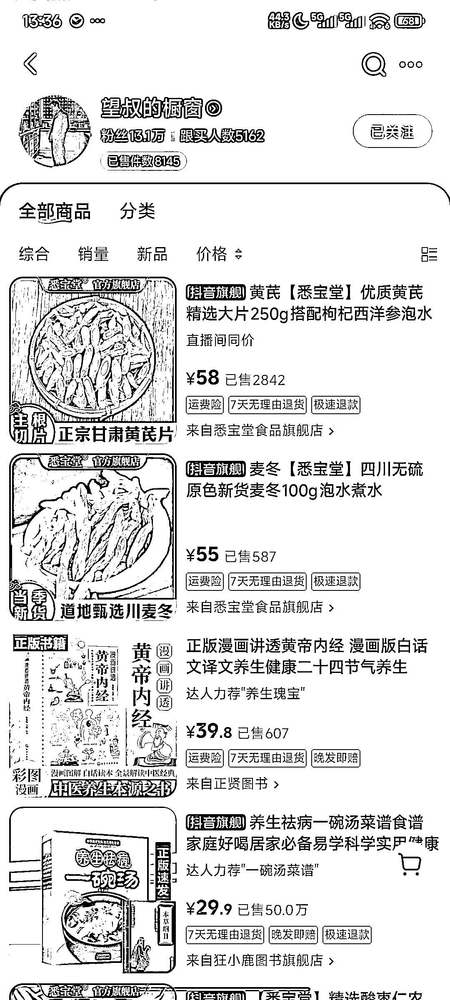
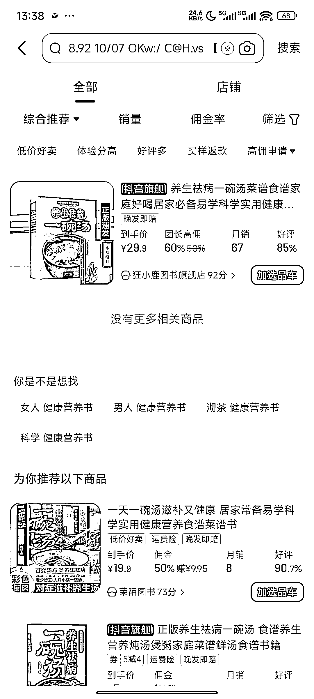
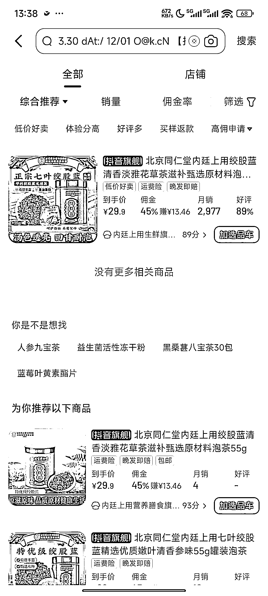
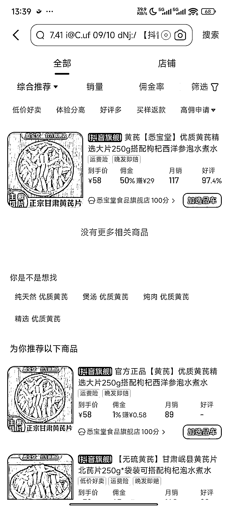

# 15 天用 AI 做视频发布 50 个视频涨粉十万 橱窗带货 8000+份 变现十万元

> 原文：[`www.yuque.com/for_lazy/wind/am7i6mdoepng2z59`](https://www.yuque.com/for_lazy/wind/am7i6mdoepng2z59)

作者： 枫晓陌 超强执行力

日期：2025-09-05

点赞数：**17**

* * *

正文：

15 天用 AI 做视频发布 50 个视频涨粉十万 橱窗带货 8000+份 变现十万元
1.用 AI 制作看故事学中药的科普视频，避开大部分违禁词，评论区挂橱窗链接引导变现。
2.目前公开出来第一个视频发布时间是 8.20 日，平均每天发布三个视频，可以用 coze 工作流制作。
3.我选了他橱窗里面的三个产品，看看佣金，挺高。45%-60%的佣金率。按照平均佣金单价 10 元左右，这个账号半个月变现 10 万元。

* * *

评论区：

张集慧 : 数据是假的，橱窗 8000 多单不是 8 月后中医内容出的，实际发布中医内容带货收益不足 1000

枫晓陌 超强执行力 : 👍👍在哪看到的

张集慧 : 这几天又卖出一些，不止 1000 了

枫晓陌 超强执行力 : 谢谢老板告知

看好你 : 这中 5 分钟以上的视频 是靠工作流做出来的啊

枫晓陌 超强执行力 : 可以搞出来的。你在抖音搜索一下：看故事学中药视频制作，会有不少教程。当然，手动也可以，但比较麻烦。

亦仁 : 感谢分享，已中标

* * *

公众号懒人搜索，[懒人专属群分享](https://lazybook.fun/#/blog/group)