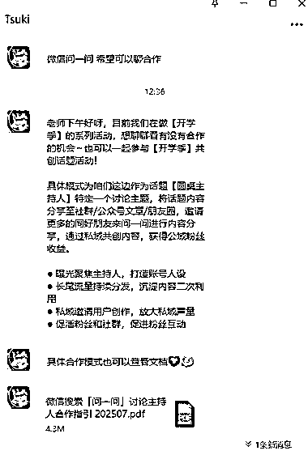
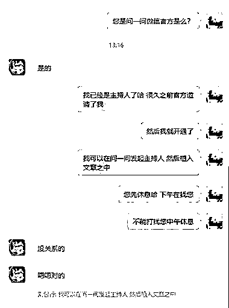
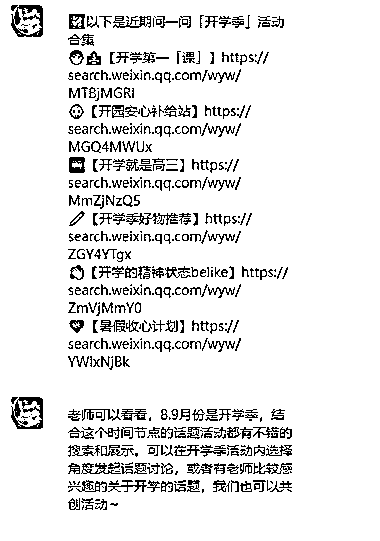

# 问一问=官方扶持+流量闭环，后续卖产品课程都能变现

> 原文：[`www.yuque.com/for_lazy/wind/lln16n21getphg3c`](https://www.yuque.com/for_lazy/wind/lln16n21getphg3c)

作者： 刘智行

日期：2025-09-01

点赞数：**12**

* * *

正文：

收到了问一问的官方邀约 问一问现在流量很大，一直在推 包括官方下场邀约有影响力的博主 临近开学，很多热门话题即将启动 能够带来一波不小的流量，并且可以持续
你想做什么活动，也可以跟官方人员沟通 可以共创 问一问-公众号-视频号-私域流量可以完全打通，积累流量池 后续卖产品、课程、收徒等都很不错

* * *

评论区：

亦仁 : 感谢分享，已中标

* * *

公众号懒人搜索，[懒人专属群分享](https://lazybook.fun/#/blog/group)