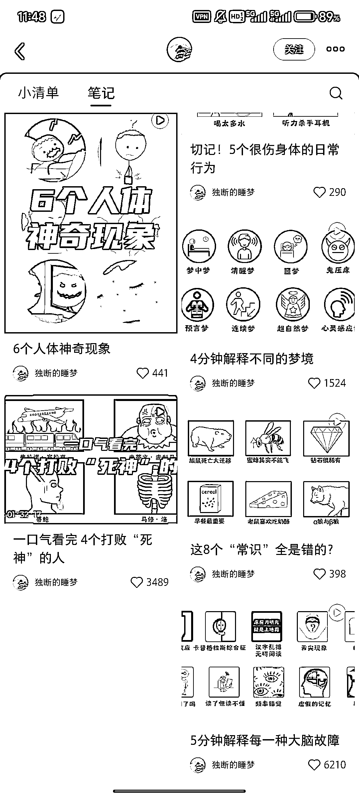
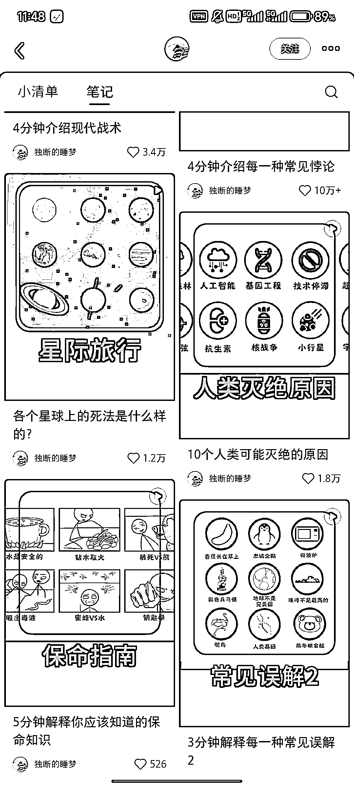
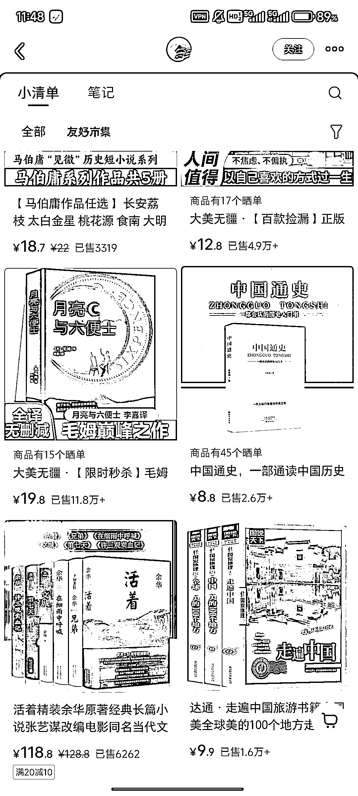

# 小红书账号 3 个月 40 条视频涨粉 4 万+，封面和标题是吸引客户的重点

> 原文：[`www.yuque.com/for_lazy/wind/nofdvpkd0741ltvt`](https://www.yuque.com/for_lazy/wind/nofdvpkd0741ltvt)

作者： 小武

日期：2025-09-01

点赞数：**27**

* * *

正文：

真是所有都值得用漫画再做一遍。 这个小红书账号，从 6 月开始更新，到目前近 40 条视频涨粉 4 万+，但这销量是真的可怕。
这个小红书的封面很值得借鉴，直接把最吸引我的图放出来了。说实话，我单看着封面和标题就能让我看完

* * *

评论区：

石榴爸爸 : 这个橱窗的销量，是怎么博主的销售还是这个产品总的销量呢🤔

浮生 : 小清单是商品的总销量，并不全是他带的货

亦仁 : 感谢分享，已中标

* * *

公众号懒人搜索，[懒人专属群分享](https://lazybook.fun/#/blog/group)