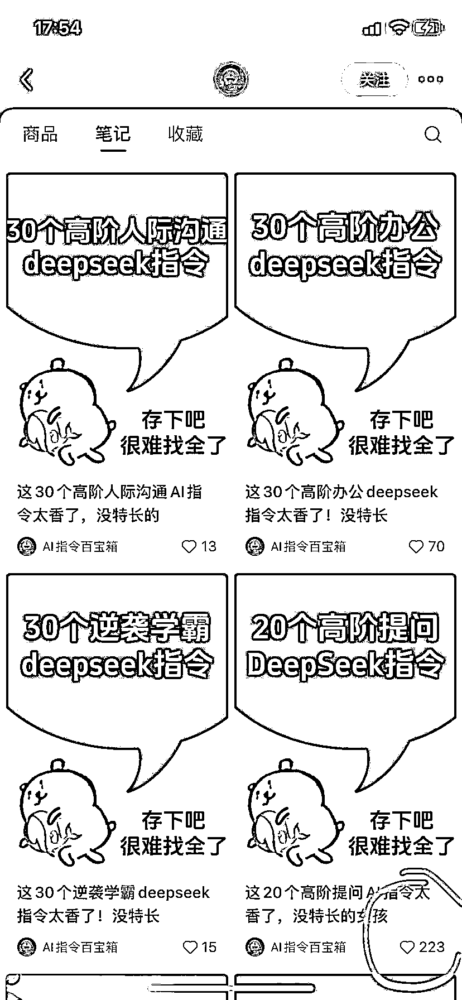

# 小红书发 deepseek 指令，每隔几条就有爆款！

> 原文：[`www.yuque.com/for_lazy/wind/ondysrtyvwk8vaga`](https://www.yuque.com/for_lazy/wind/ondysrtyvwk8vaga)

作者： 飞掌柜

日期：2025-08-29

点赞数：**30**

* * *

正文：

一、案例描述（账号/项目/打法/现象） 1、该账号只做 deepseek 指令，发了 40 多条作品，涨粉 3486。
2、有一条爆款就快速开通商品，卖知识付费引流课，GMV 近 20 万，妥妥属于低粉高变现！ 二、数据表现（播放量、GMV、截图等）
1、每发几条指令合集，就有一条小爆款，一开始是 200 多、500 多收藏，后来是 2800 多、3700 多收藏，真的可以借鉴。
2、已经开通商品店铺，通过知识付费项目变现，引流课包括 AI 智能体课程、AI 人工智能应用课、Excel 课程，后续还有高阶课程。 3、以职场
Excel 数据分析课程举例，客单价 5 块，卖了 3.9 万多份，GMV 近 20 万，变现数据真不错。 三、机会剖析（初步判断：比如 ROI 高、成本低、可复制性强）
1、deepseek 指令有很多资料，互联网上一大堆，在自媒体圈子收集下，也会有不少。有些 deepseek 指令甚至可以通过 AI 大模型生成并整理。
2、指令用卡片方式，可以用稿定设计等软件批量化制作，AI 一键生成。封面是模板，标准化，每个作品都是，保持封面统一，只更改标题即可。
3、模式简单，可以复制，上手难度小，并且卖虚拟资料，卖引流课程，净利润很高，ROI 很高。

* * *

评论区：

亦仁 : 感谢分享，已中标

飞掌柜 : 感谢老大，继续努力💪

* * *

公众号懒人搜索，[懒人专属群分享](https://lazybook.fun/#/blog/group)