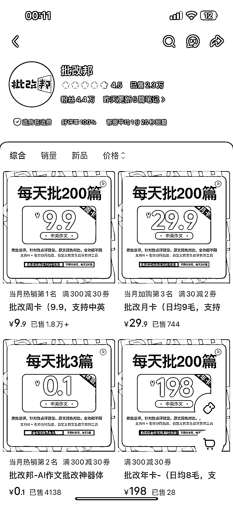
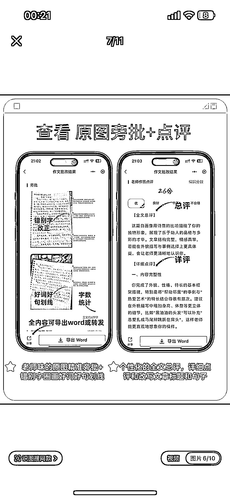
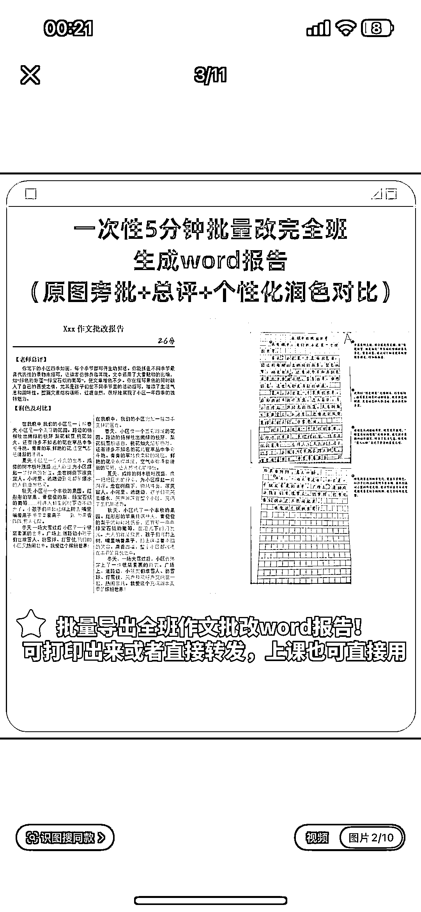
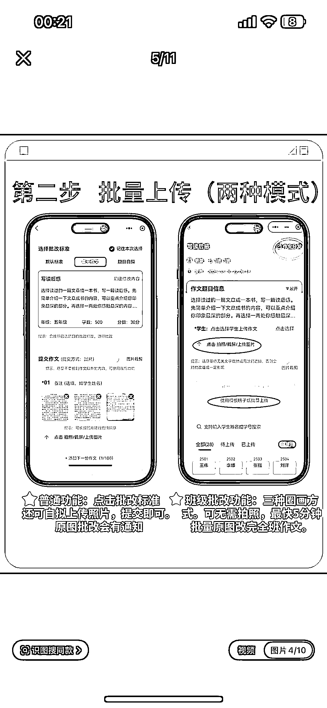
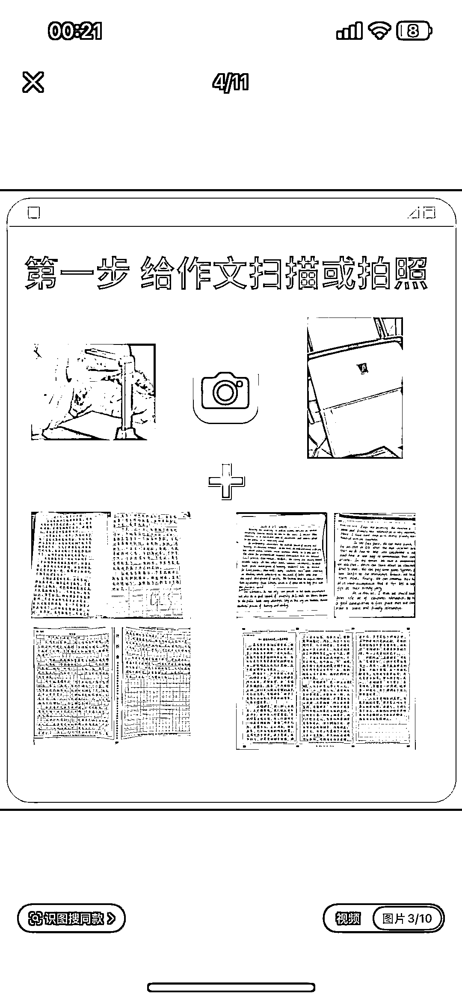
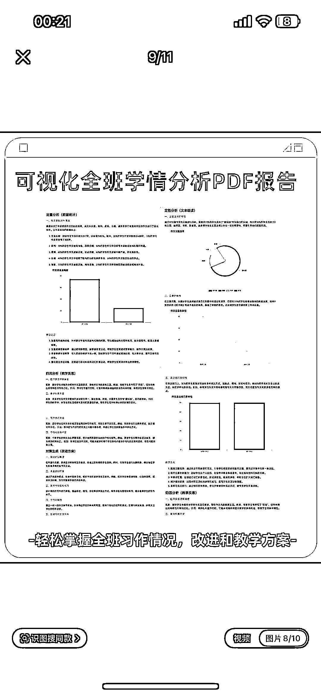
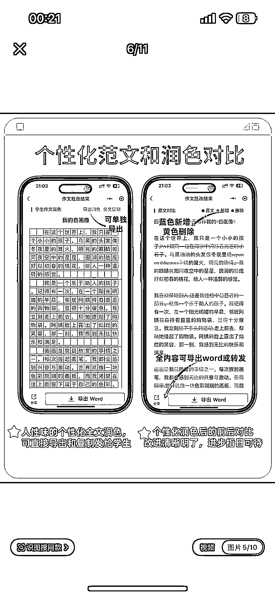
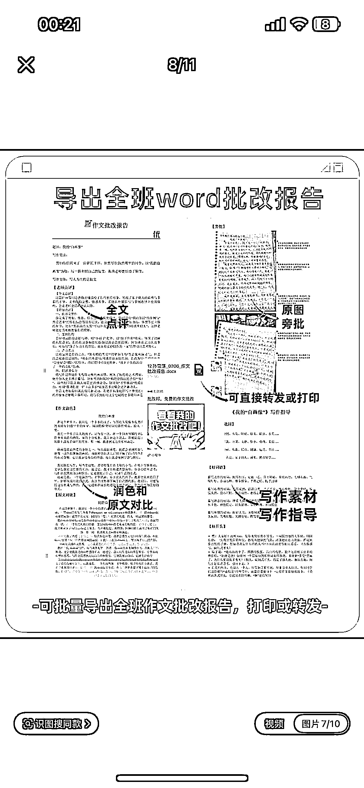
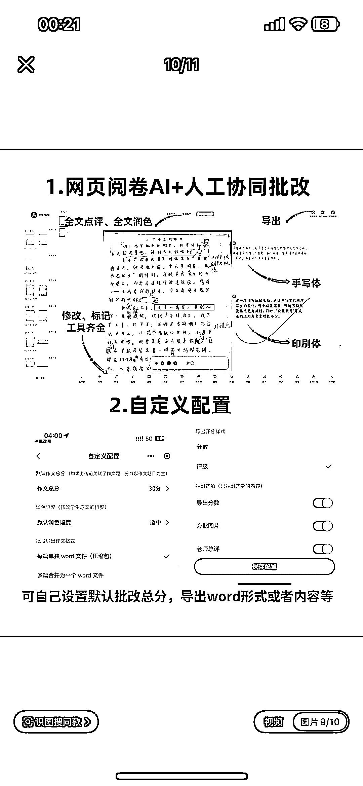

# 小红书 AI 作业批改赛道，销量 2 万+，其他科目也适用

> 原文：[`www.yuque.com/for_lazy/wind/rzbpbkzllwfwcggq`](https://www.yuque.com/for_lazy/wind/rzbpbkzllwfwcggq)

作者： 阿牛

日期：2025-09-03

点赞数：**32**

* * *

正文：

【build in 小红书】 赛道/细分方向 小红书/ai 作业批改赛道分析 案例描述：
专注于 ai 作文批改工具，粉丝 2.2 万，已售 2.3 万件，定位老师/家长的高效批改助手，弱化 ai 标签，强调实用价值 为什么是机会：
开发成本很低，看接入的也是国产大模型 DeepSeek，可以从作文批改-全科作业批改

* * *

评论区：

亦仁 : 感谢分享，已中标

* * *

公众号懒人搜索，[懒人专属群分享](https://lazybook.fun/#/blog/group)