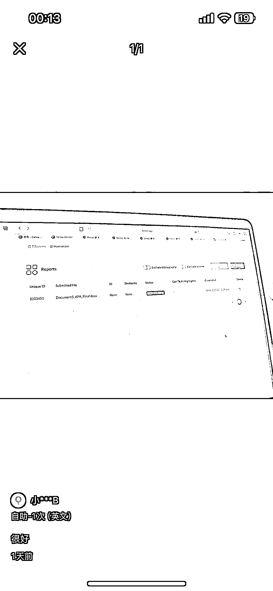
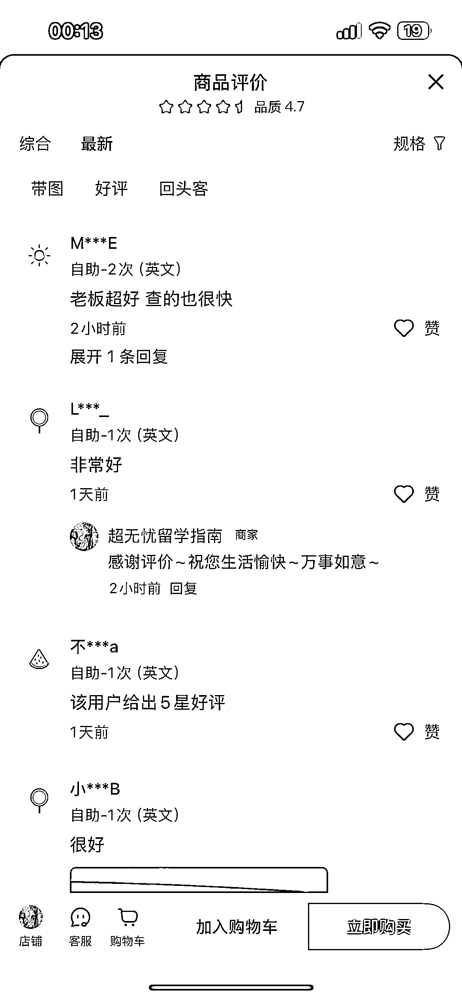

# 小红书-学术服务赛道英文论文查重自动化流程销售 3 万+，gmv7w

> 原文：[`www.yuque.com/for_lazy/wind/cy74sd67huk6yxa3`](https://www.yuque.com/for_lazy/wind/cy74sd67huk6yxa3)

作者： 阿牛

日期：2025-09-04

点赞数：**23**

* * *

正文：

赛道细分方向 小红书/学术服务赛道下面的英文论文查重 案例描述：专注于英文论文查重（Turnitin 系统检测），满足留学生，科研人员的刚需 数据：
商品显示已销售 3.5w 件，按照 2 元一次，gmv 至少 7w，而且价格比 Turnitin 官网便宜不少，很有竞争力 为什么是机会：
ai 编程找到 api 调用，写成自动化流程，全程不用人参与，留学生付费意愿强，跑通后可扩展其他查重业务，也可增加降重服务，后续做大也可以对接一些机构把资源循环利用起来

* * *

评论区：

亦仁 : 感谢分享，已中标

* * *

公众号懒人搜索，[懒人专属群分享](https://lazybook.fun/#/blog/group)