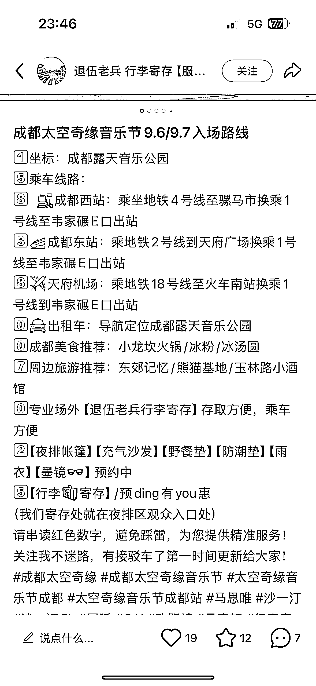
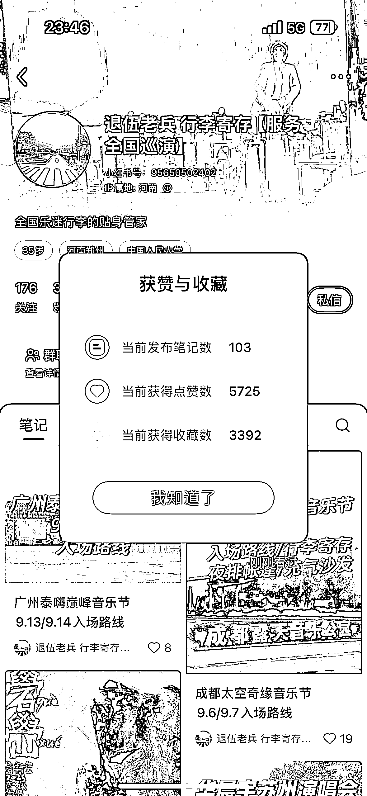
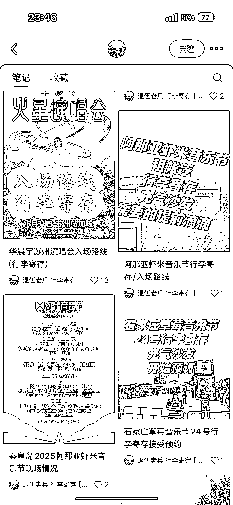

# 为音乐节和演唱会提供行李寄存服务的小众赛道，获赞 3000+

> 原文：[`www.yuque.com/for_lazy/wind/qsaqfc1hrvy5wpak`](https://www.yuque.com/for_lazy/wind/qsaqfc1hrvy5wpak)

作者： 爱搞钱的宋宋💰

日期：2025-09-02

点赞数：**19**

* * *

正文：

因为我这周刚好要去看音乐节哈，小红书这个大数据还是很精准马上就给我推笔记了，所以才刷到这个账号的
这个号粉丝不多但是在悄悄赚钱，很细分的人群，给全国比较热门的音乐节和演唱会提供行李寄存服务
很多人为了追星都是飞去很远看现场，机票门票这种大头钱都花了，寄存这种小钱也不在话下，如果有轻微溢价都是能够接受的🤔 而且大家去外地，追星女都是大包小包恨不得把衣柜打包去演唱会现场哈，都会带行李箱出门，而且赶行程确实带着行李箱很不方便
这个服务完美解决了痛点！！！是我我也愿意花钱买这个服务☺️ 引流形式我还是第一次看到，详情见图一的数字

* * *

评论区：

亦仁 : 感谢分享，已中标

爱搞钱的宋宋💰 : 谢谢老大[爱心]

* * *

公众号懒人搜索，[懒人专属群分享](https://lazybook.fun/#/blog/group)