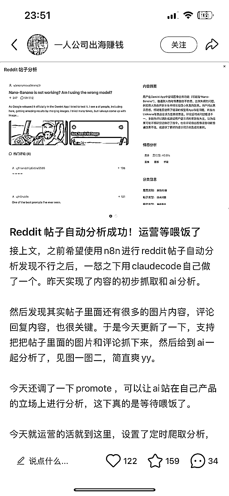
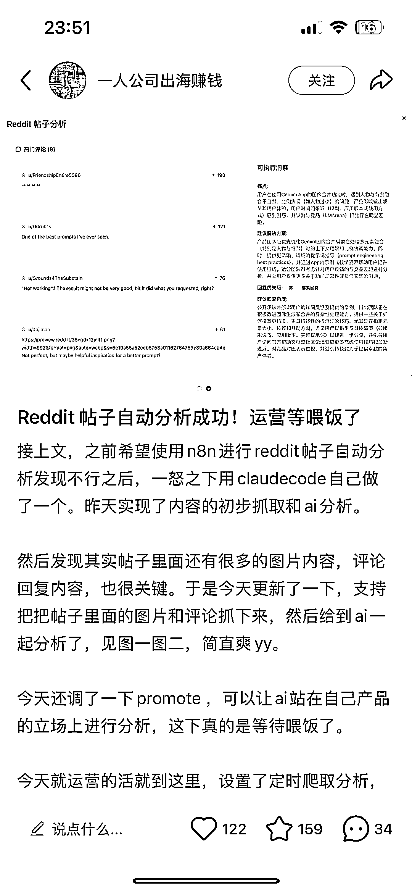
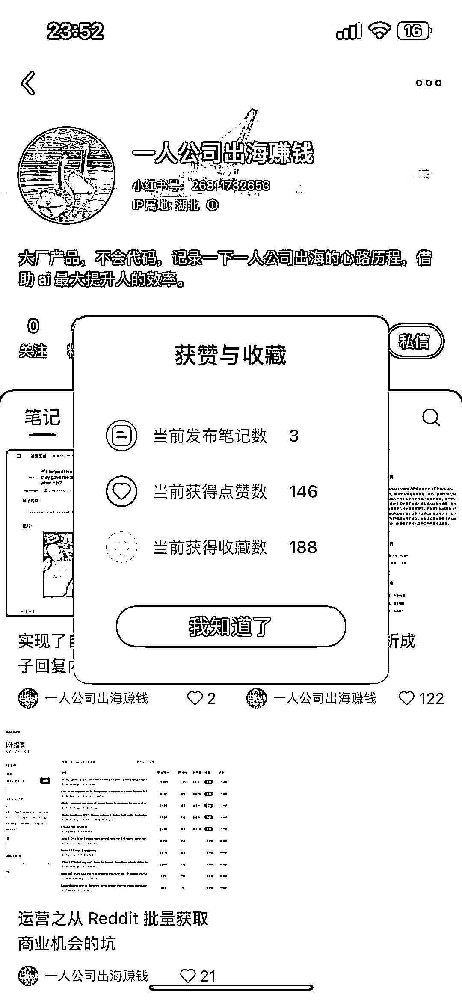

# 结合 AI 编程搭建小红书-Reddit 自动化运营工具，打造 Saas 平台获取订阅

> 原文：[`www.yuque.com/for_lazy/wind/nq467rzpp2v3pbhn`](https://www.yuque.com/for_lazy/wind/nq467rzpp2v3pbhn)

作者： 阿牛

日期：2025-09-03

点赞数：**20**

* * *

正文：

【build in 小红书】 赛道/细分方向 小红书/Reddit 自动化运营工具 案例描述：
作者发了三篇帖子，点赞 146，收藏 188，评论区有想内测用户和付费用户 为什么是机会
可以结合 AI 编程，构建产品的门槛变得很低，通过网上一些开源的方案快速搭建 mvp 产品进行内测，打造出 saas 平台获取订阅，后续可以直接生成每天日报和邮件推送到用户！

* * *

评论区：

亦仁 : 感谢分享，已中标

* * *

公众号懒人搜索，[懒人专属群分享](https://lazybook.fun/#/blog/group)