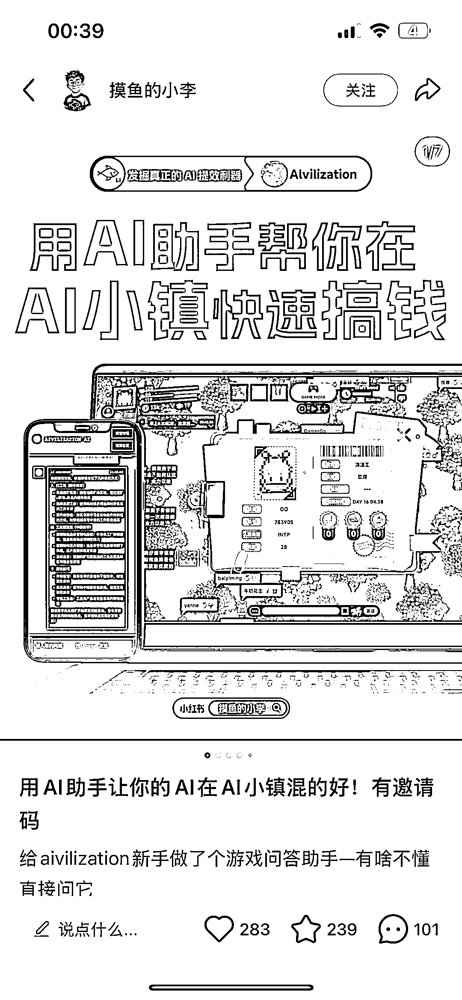
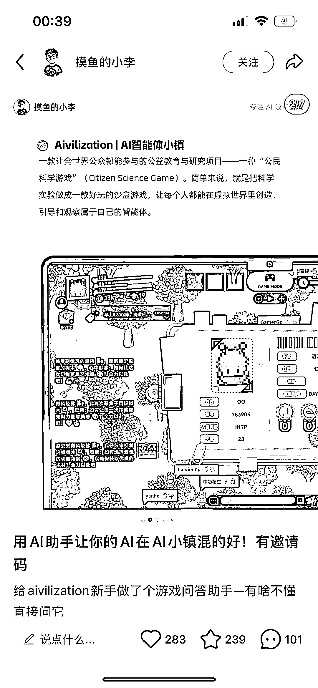
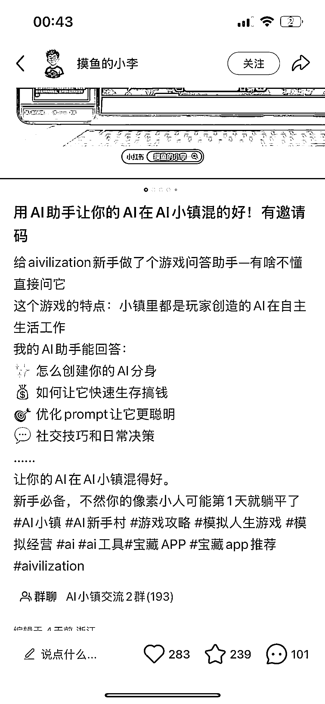
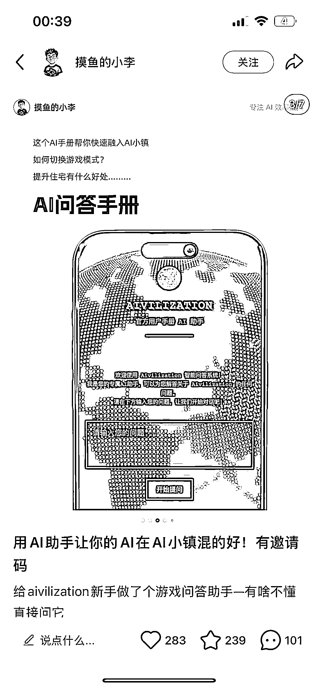
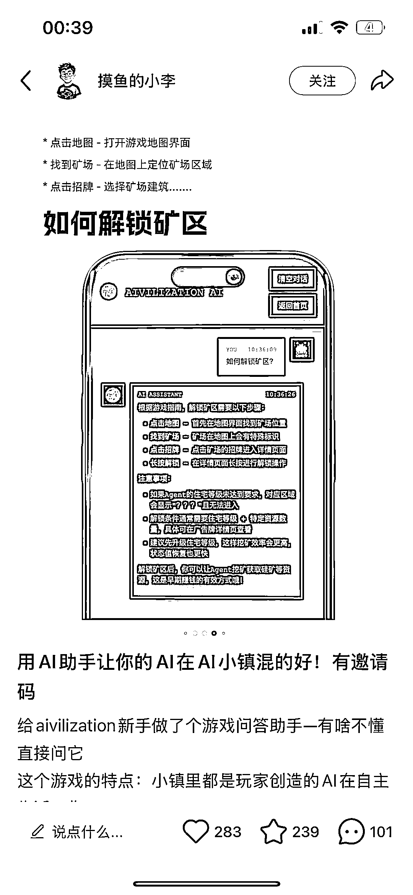
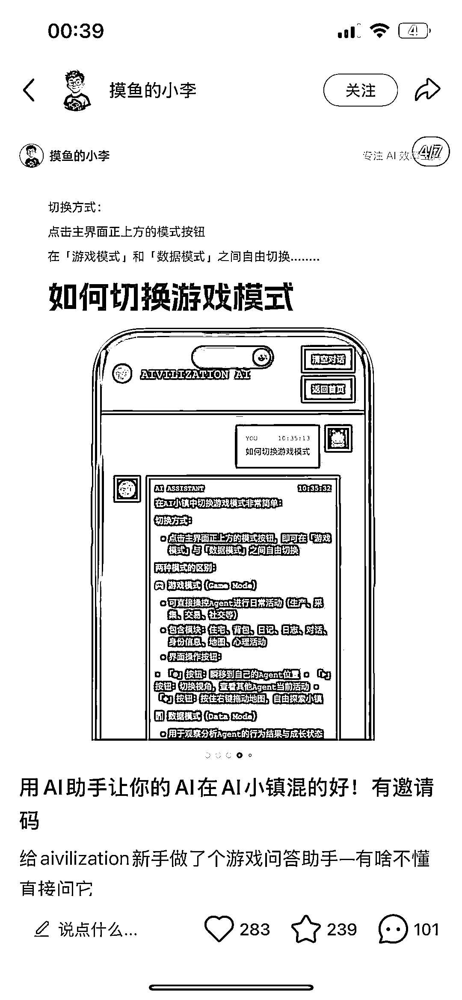
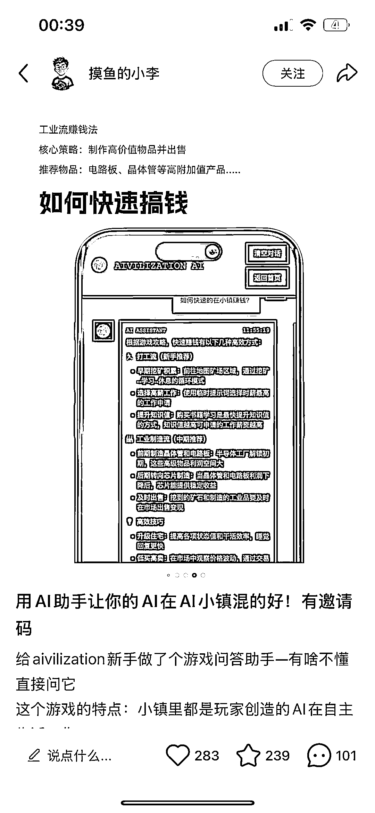
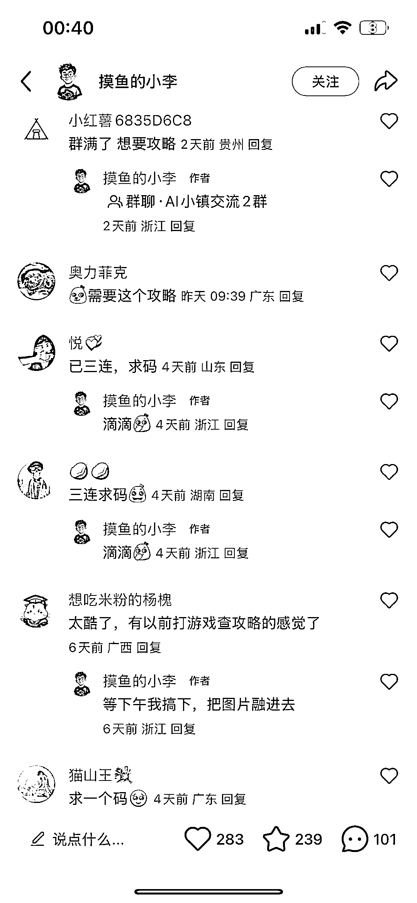

# 小红书蹭 AI 小镇热点，引流做攻略 App，4 天吸粉 600+

> 原文：[`www.yuque.com/for_lazy/wind/iq1zve37m0hg8w4y`](https://www.yuque.com/for_lazy/wind/iq1zve37m0hg8w4y)

作者： 阿牛

日期：2025-08-30

点赞数：**17**

* * *

正文：

赛道：小红书/AI 助手攻略 案例描述：借助网上爆火的 AI 小镇页游，自己实现了一个 ai 助手类的游戏类攻略 app
数据：四天时间，已经创建两个小红书群聊，人数至少 600+ 为什么是机会：
通过发放 ai 小镇邀请码的形式，间接的引流到群聊，并给自己的 app 冷启动导流，在内测中不断迭代自己的 app，最终实现订阅收费！

* * *

评论区：

亦仁 : 感谢分享，已中标

* * *

公众号懒人搜索，[懒人专属群分享](https://lazybook.fun/#/blog/group)