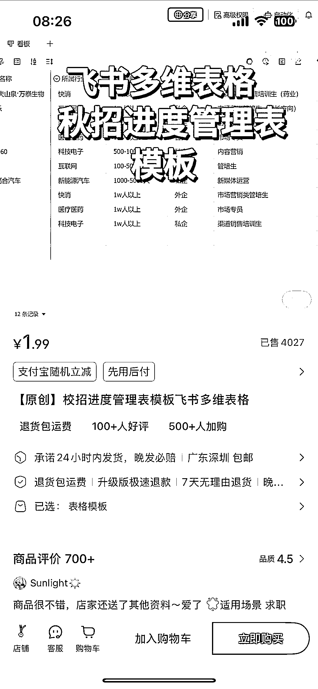
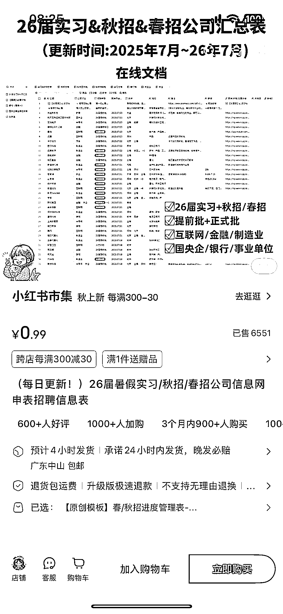

# 小红书-秋招飞书多维表格，客单价 1.99，销量 4000 单

> 原文：[`www.yuque.com/for_lazy/wind/sopk822ldfkkyiow`](https://www.yuque.com/for_lazy/wind/sopk822ldfkkyiow)

作者： 阿牛

日期：2025-08-31

点赞数：**21**

* * *

正文：

小红书/秋招飞书多维表格 案例描述：借助飞书的生态红利，采用低价爆款策略，售卖秋招信息招聘表，进度表！
数据：第一家客单价 1.99 卖了 4000 单，第二家卖了 6000 单 为什么是机会： 模版开发成本很低，可以借助飞书+现有的模版复用
后期可以提供会员服务，或者 1v1 配置指导服务，以及获取一些定制化服务需求！

* * *

评论区：

阿宝 : 我关注挺久了，就是不知道他们这些秋招信息是怎么整合的[捂脸]

小小苏 : 是不是自己写的脚本采集过去的😂

阿宝 : 有可能吧 谁可以弄？[捂脸]

刘土豆 : 卖的最顶的是圈友，9.9 卖了两万多单了，还在爆

阿宝 : 是爬虫爬的吗

亦仁 : 感谢分享，已中标

* * *

公众号懒人搜索，[懒人专属群分享](https://lazybook.fun/#/blog/group)