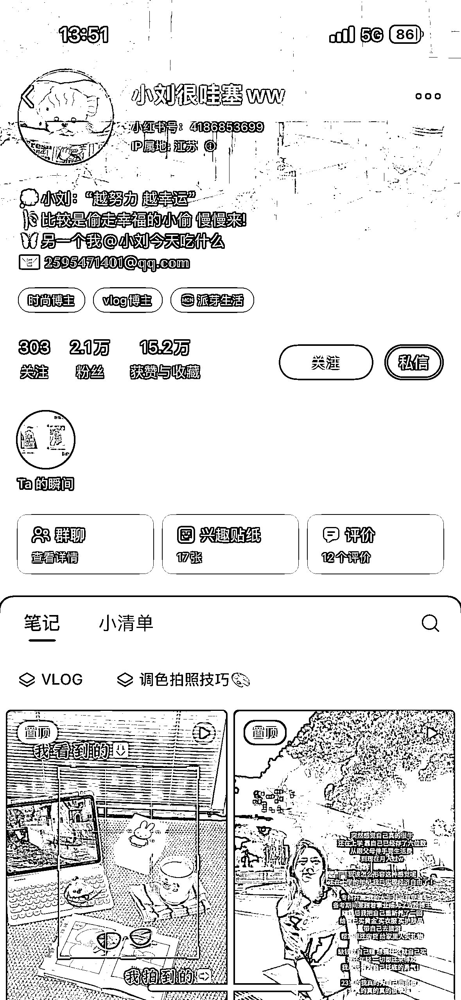
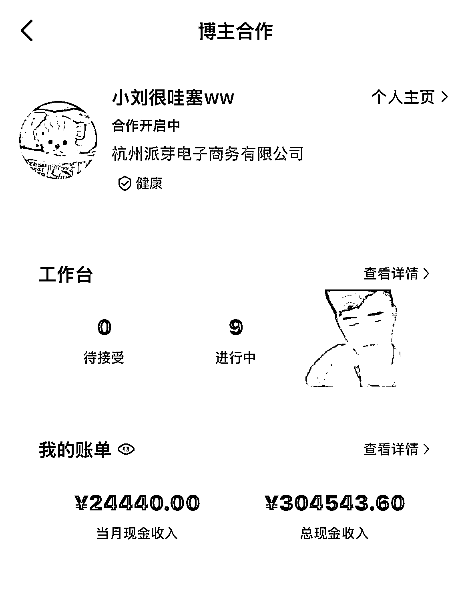
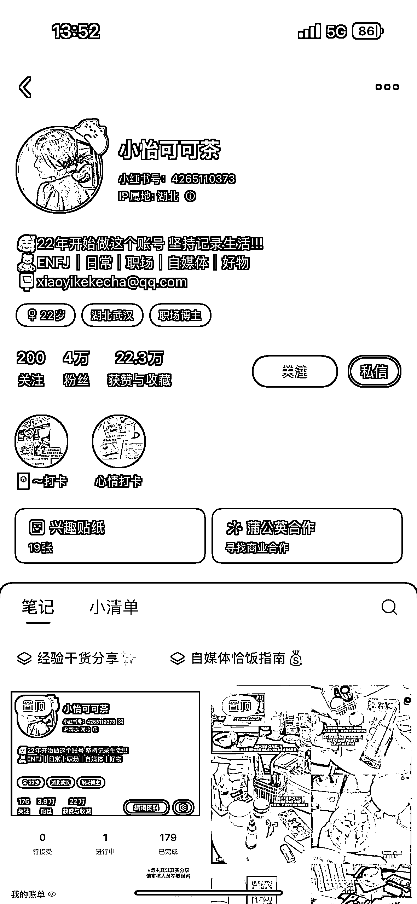
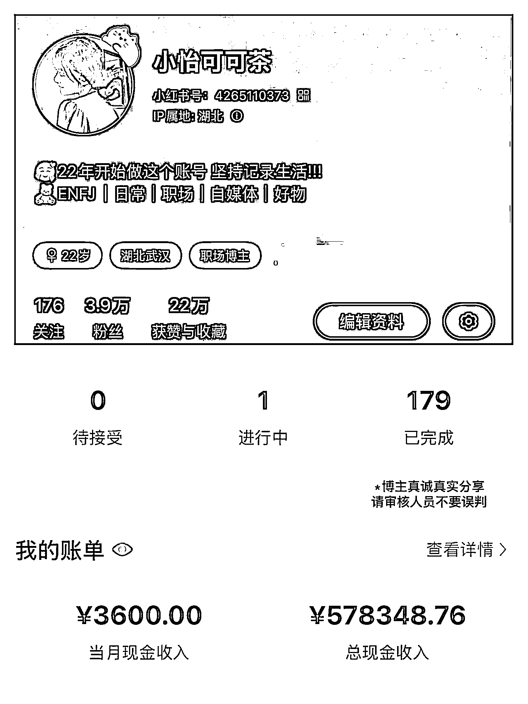

# 小红书 vlog 博主粉丝点赞一般但变现惊人，笔记嵌入广告一个月变现 1w+

> 原文：[`www.yuque.com/for_lazy/wind/vpqgizr5fgv3lzk3`](https://www.yuque.com/for_lazy/wind/vpqgizr5fgv3lzk3)

作者： 馆主

日期：2025-09-03

点赞数：**16**

* * *

正文：

风向标-变现｜异常值 最近挖掘小红书发现这么几个博主，粉丝量和点赞数据不怎么样，但是变现能力真的太吓人啦！ 图一：这位博主的账号定位是日常记录 vlog
账号风格统一，封面是使用四宫格 笔记/商业笔记—都是使用日常 vlog 来发布的 也就是说每篇日常笔记里面都插入广告在里面
有些笔记蹭致插了几个广告在里面，一个广告坑位费是 500 块钱，这位博主基本日更，也就是说一个月最少能赚 1.5w¥
图四：这位博主的账号定位也是日常记录 vlog，不过他做的是职场博主，基本也是发日常笔记为主，每天日常笔记也都是商业笔记
果然大钱在行业深处，坚持做到后面，只会越来越吃香

* * *

评论区：

亦仁 : 感谢分享，已中标

* * *

公众号懒人搜索，[懒人专属群分享](https://lazybook.fun/#/blog/group)