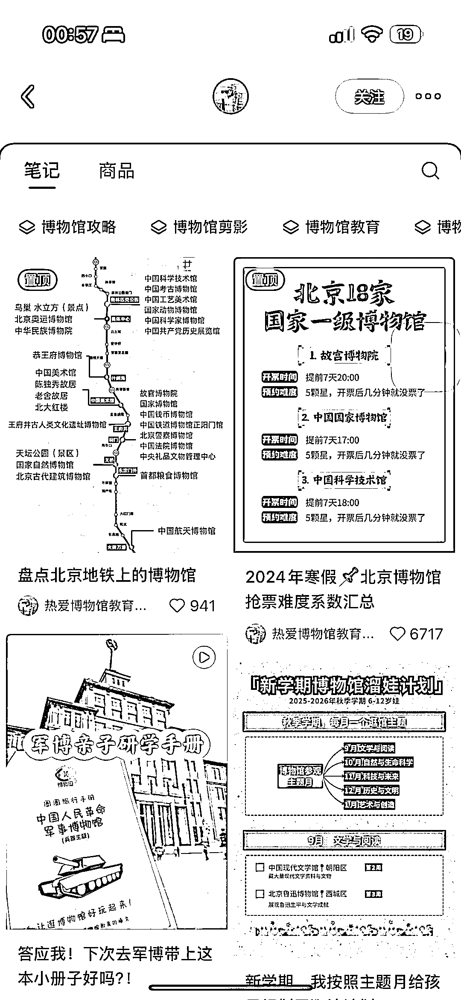
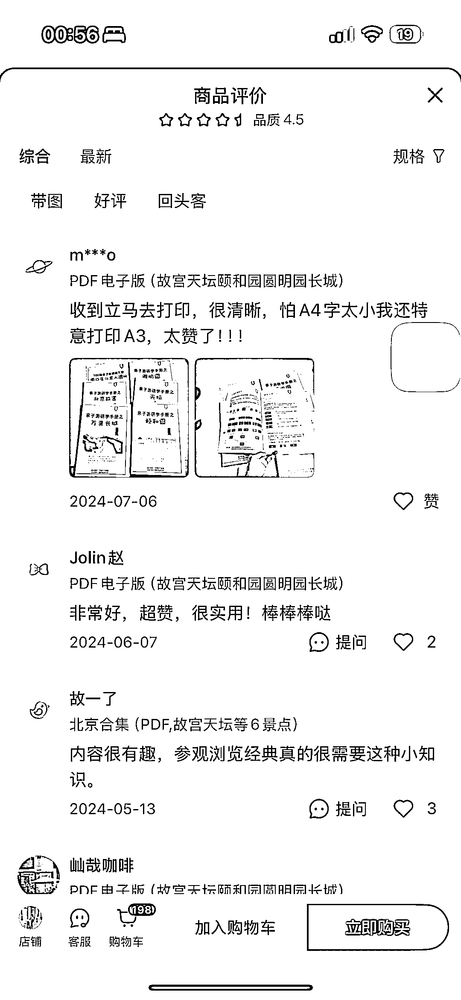
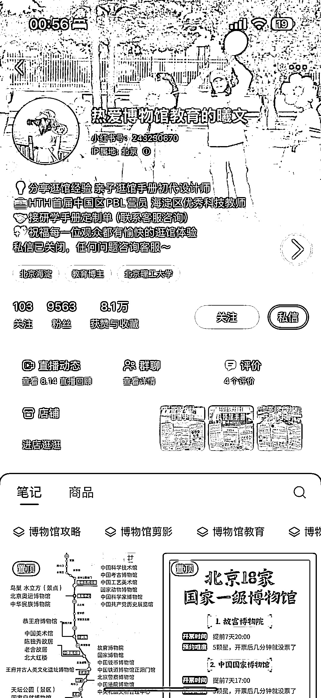
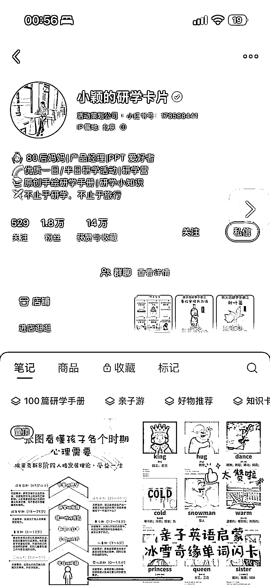
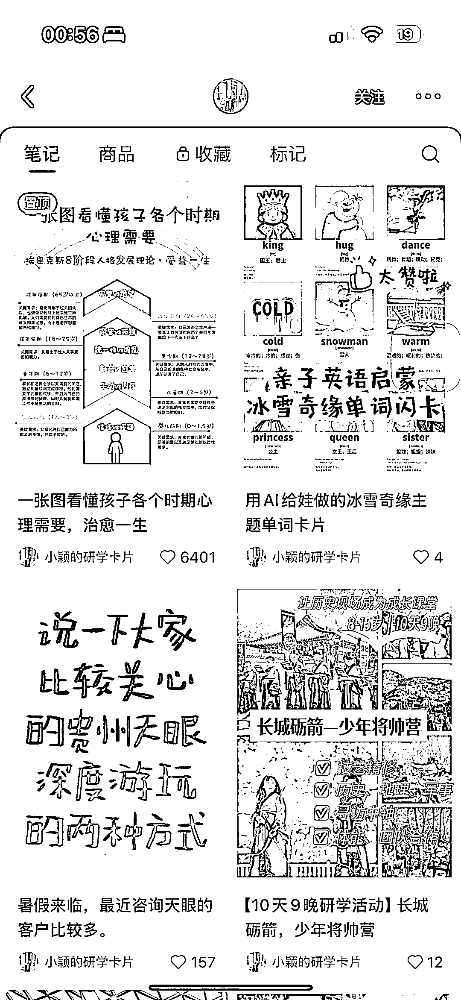

# AI 研学赛道：一份博物馆手册能卖 2000 份，售价仅 8.9 元

> 原文：[`www.yuque.com/for_lazy/wind/nxmruedhc2a2p483`](https://www.yuque.com/for_lazy/wind/nxmruedhc2a2p483)

作者： 🌟Lisa🌟

日期：2025-08-31

点赞数：**15**

* * *

正文：

【AI 研学】博物馆研学手册 【赛道/细分方向】 亲子研学与教育启蒙类虚拟资料（数字产品）
该赛道核心是围绕博物馆、科技馆、历史古迹、热门 IP 等研学主题，创作并销售数字化的学习资料。 主要产品形式包括： 1. 原创手绘研学手册：针对特定场馆或路线设计的探索指南、任务卡、手账等。 2. 知识卡片/单词闪卡：利用热门 IP 或主题，制作中英文对照的科普或启蒙卡片。
3. 攻略与信息汇总：如博物馆抢票攻略、地铁沿线博物馆盘点、开放信息等，常作为引流内容。 【案例描述】
店铺专注于销售单一城市或场馆的研学手册电子版，如西安、南京博物院、河西走廊、景德镇等。
产品标准化，售价在¥8.9 至¥24.9 之间，但销量惊人（许多商品售出量在 1000-2000 份），证明了市场的广泛需求。 【数据/截图/来源】
小红书关键字“研学资料” 【为什么是机会】 1. 需求刚性增长：“双减”政策后，家长对孩子综合素质教育和体验式学习（研学）的需求爆发式增长。但家长普遍面临“没时间做功课、不专业”的痛点，急需现成的、高质量的研学辅助工具。
2. 供给高度分散：全国博物馆、科技馆、历史名城众多，但目前市场上成体系、高质量、有趣味的研学虚拟资料依然稀缺，存在大量市场空白。 3. 低成本高效益模式： - 成本极低：一次创作，可无限次复制销售，无需物流、库存成本。 - 流量精准：小红书平台是宝妈群体的聚集地，用户主动搜索“研学”、“博物馆攻略”等关键词意愿强，流量非常精准，转化率高。 - 变现路径清晰：既可以销售标准化产品（电子手册），也可以提供高溢价定制服务（为机构定制），还能通过干货内容引流至线下研学营，商业模式多元且健康。 4. 成功案例验证：提供的多个案例已成功跑通商业模式，从内容创作、引流、到商品销售形成了完整闭环，证明了该赛道在小红书上的可行性和盈利能力。

* * *

评论区：

亦仁 : 感谢分享，已中标

* * *

公众号懒人搜索，[懒人专属群分享](https://lazybook.fun/#/blog/group)