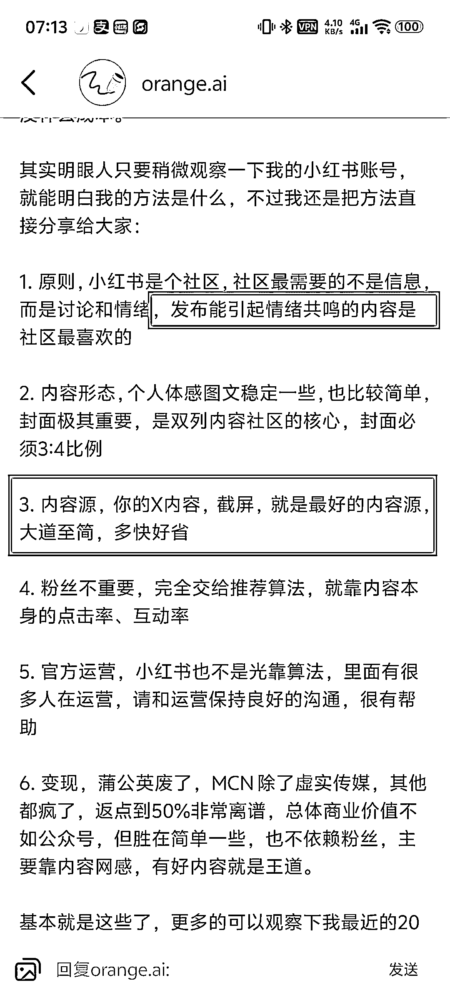
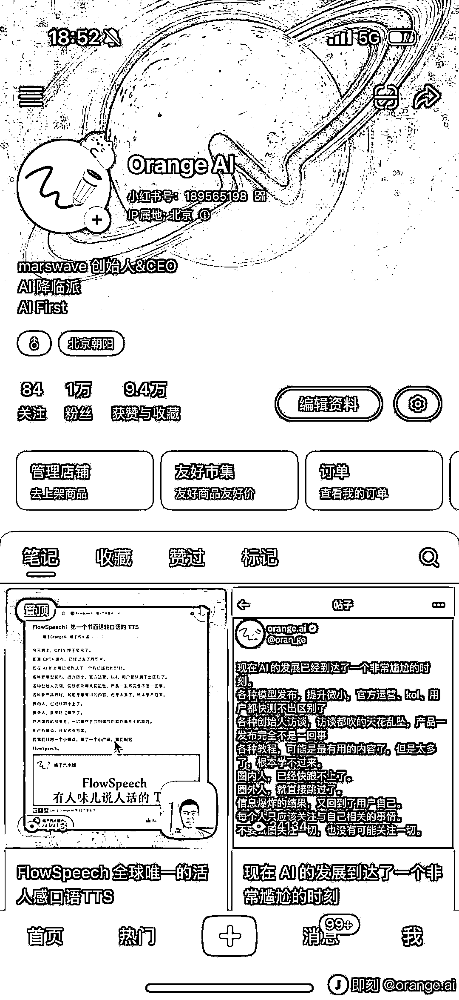
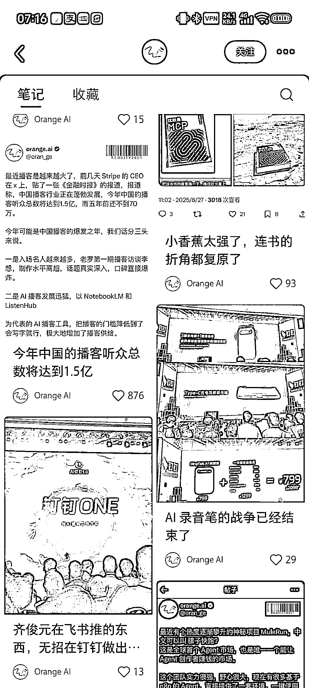
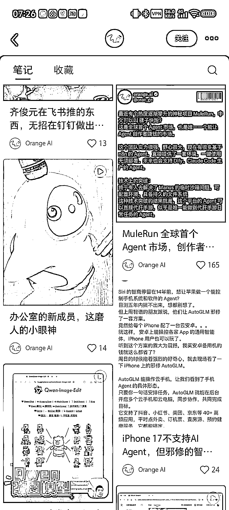
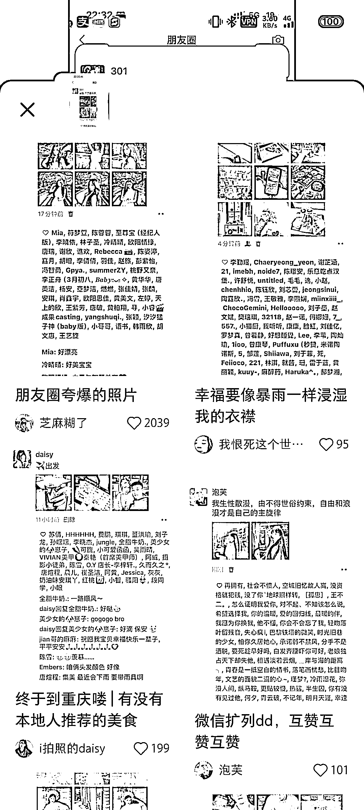

# 截图=共鸣感，小红书内容运营的低成本玩法

> 原文：[`www.yuque.com/for_lazy/wind/bh90wg5ohz2iacs0`](https://www.yuque.com/for_lazy/wind/bh90wg5ohz2iacs0)

作者： 清仔

日期：2025-09-03

点赞数：**21**

* * *

正文：

截图其他平台的内容，天生具有真实感，在小红书能更好的得到共鸣。
orange.ai 在即刻分享了他做小红书的心得，我发现一个异常值——用其他平台的截图做首页内容，容易爆
目前没做小红书，但做其他平台自媒体的可以试试，低成本高效率运营 -x 出海：参考 orange -微信私域：截图朋友圈，在朋友圈已经爆了
-垂直小号：在公众号已经爆了

* * *

评论区：

亦仁 : 感谢分享，已中标

四目相对 : 我再去即刻没有找到这篇原文哎，作者是不是自己删了

清仔 : 看了下还在，是 8.7 的文章，可以往前翻一翻。或者直接在即刻搜一下关键词，如[小红书是个社区]，就有了

四目相对 : 哈哈哈哈好的好的 8.7 的找到了，搜了最近半个月的，没想到这么前面，感谢

* * *

公众号懒人搜索，[懒人专属群分享](https://lazybook.fun/#/blog/group)