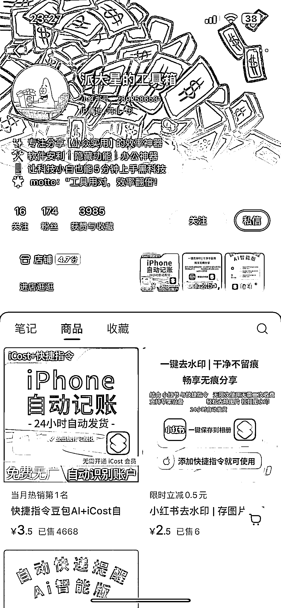
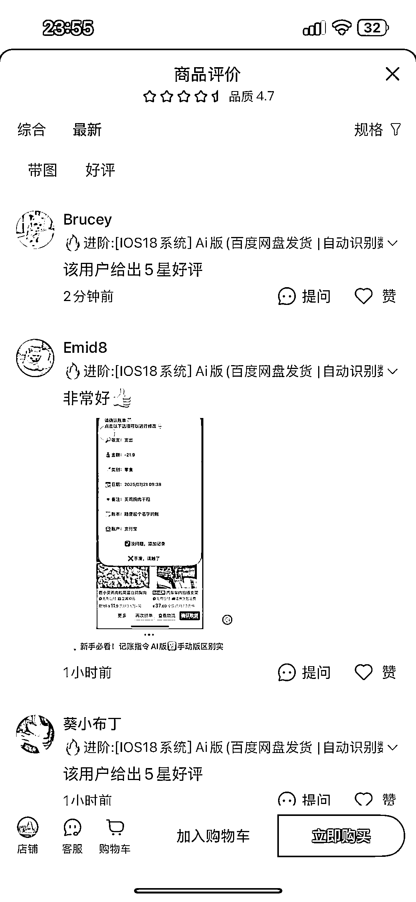
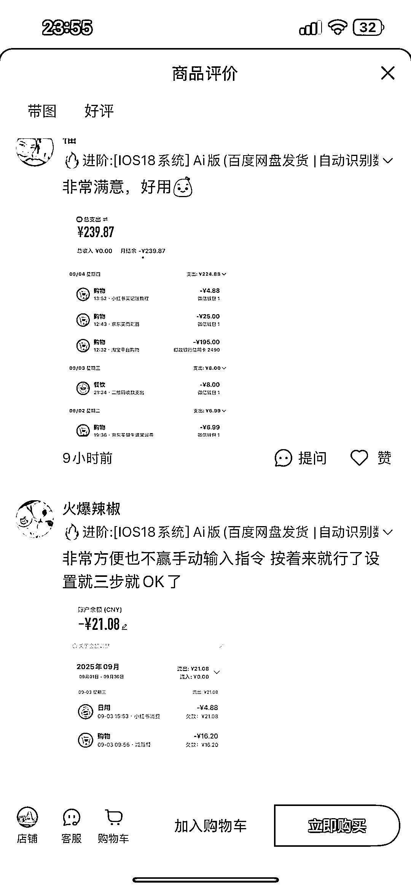
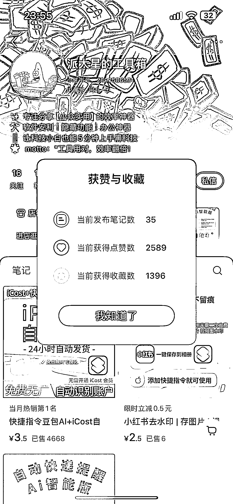

# 小红书工具商品，35 篇笔记，粉丝 174，已售 4000+

> 原文：[`www.yuque.com/for_lazy/wind/offstg3iya0v6x95`](https://www.yuque.com/for_lazy/wind/offstg3iya0v6x95)

作者： 阿牛

日期：2025-09-04

点赞数：**11**

* * *

正文：

【build in 小红书】 赛道细分 小红书/快捷指令 案例描述： 快捷指令+豆包 AI，数据存储到 iCost 文件，实现记账需求 数据
今年 4 月份起的号，目前发了 35 篇笔记，粉丝 174，已售 4543 件，gmv1w+ 为什么是机会
1.主流 app 比如鲨鱼记账 98/年，比竞品便宜 97%，开发零成本，容易上手
2.可以后期扩展 android，或者增加一些其他场景，也可以增加一些消费周报之类的功能

* * *

评论区：

亦仁 : 感谢分享，已中标

* * *

公众号懒人搜索，[懒人专属群分享](https://lazybook.fun/#/blog/group)