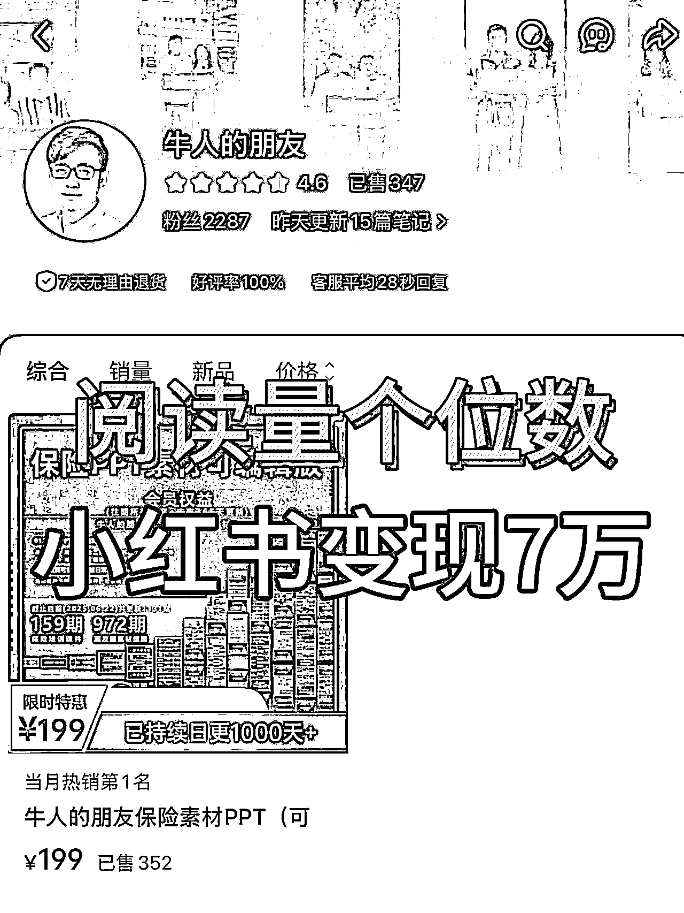
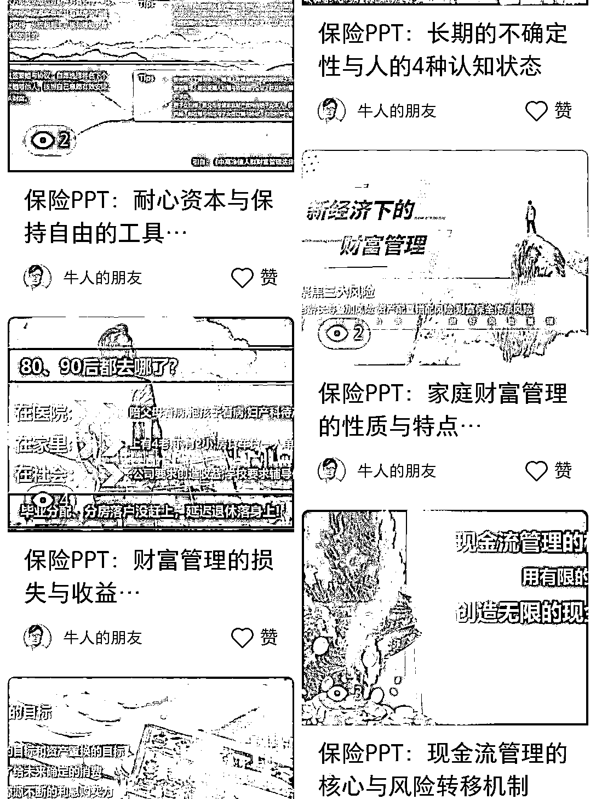
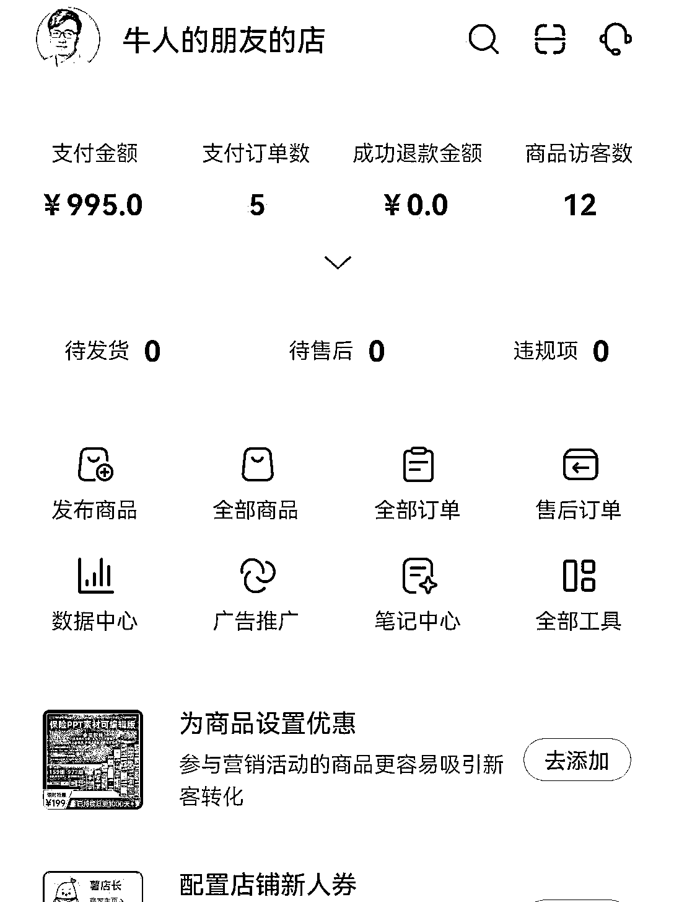
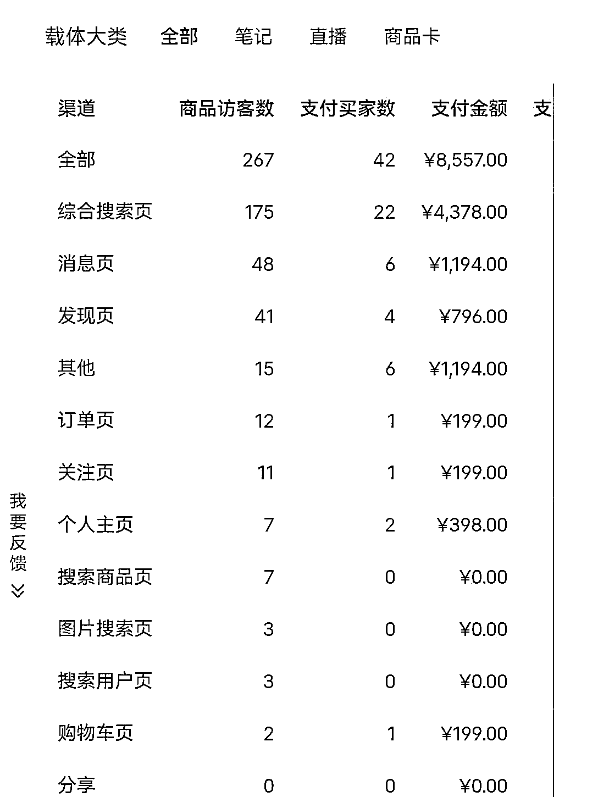

# 零投流、零爆款，小红书搜索流量也能成交 352 单

> 原文：[`www.yuque.com/for_lazy/wind/xegnbkhxok2bqbg2`](https://www.yuque.com/for_lazy/wind/xegnbkhxok2bqbg2)

作者： 哈默

日期：2025-09-05

点赞数：**34**

* * *

正文：

学会小红书搜索流量，卖课太香了！ 小红书卖课太香了，尤其是当你做好【搜索流量】 我们做了一个保险类账号【牛人的朋友】： 每篇笔记小眼睛个位数，如图 2；
但是每天都能变现 1000 元，如图 3 为啥？因为我们只做【搜索流量】 如图 4，最近变现 8000 元，绝大多数来自于【搜索流量】
如果你想做这样的账号，我给大家拆解下，我们账号的做法： 1️⃣账号核心 聚焦：保险 PPT 素材 每天更新 15 条，纯图文
PPT，零投流，靠【关键词+封面钩子】吃【搜索流量】，目的不是爆，而是【让同行和准客户随时能搜到我】 2️⃣定位 B2B 保险素材库
准客户=保险代理人/经代公司/团队长； 变现=卖 PPT 模板 3️⃣选题策略 3 大母题循环：增员/养老/分红险，占比 70%
其余穿插利率、健康险、家族信托等热点 4️⃣内容策略 N 套 PPT 模板×换标题 封面统一：白底+大字+红蓝对比； 5️⃣文案排版
标题=「保险 PPT：xxx」固定前缀 标题风格：数字+冲突+行业关键词 正文≤80 字，3 段式：痛点+数据+解决方案 结尾留钩子「完整 20 页可分享」 6️⃣笔记样式 笔记风格：极简商务风、无真人出镜 每篇笔记直接销售，统一挂载商品【可编辑版保险 PPT】 7️⃣发布时间 08:30、13:30、20:30
测试 2 个月后固定，对应保险从业者：早会/午休/陪客户时间 8️⃣个性化元素 统一落款「牛人的朋友·日更 1000 天」 强化“日更”人设，提高收藏率
所以：流量≠变现； 同时，变现也未必依靠高流量 我们就用小红书搜索流量，成交精准用户，而且纯自然流。看似每天只有没啥阅读量，但也成交 352 单，很香！
项目实操

* * *

评论区：

rrcc : 请问大佬，你们如何拿到搜索流量的?

亦仁 : 感谢分享，已中标

戴忻 : 保险行业 ppt 模板这么受欢迎吗？之前买保险的时候看了几个保险销售发来的方案，感觉 ppt 都是保险公司统一模板呢

哈默 : 必须

* * *

公众号懒人搜索，[懒人专属群分享](https://lazybook.fun/#/blog/group)