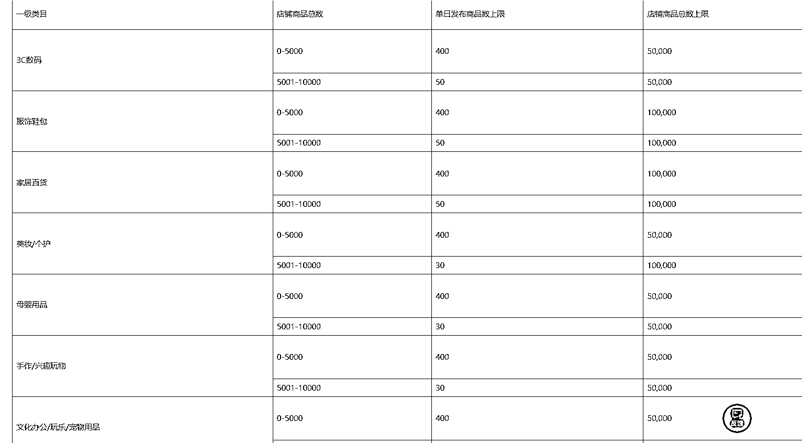
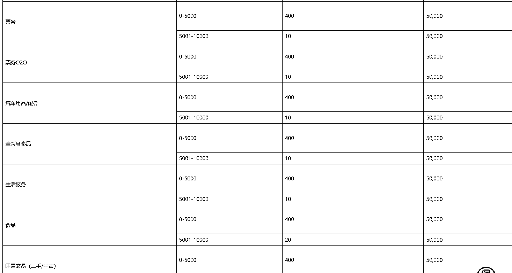
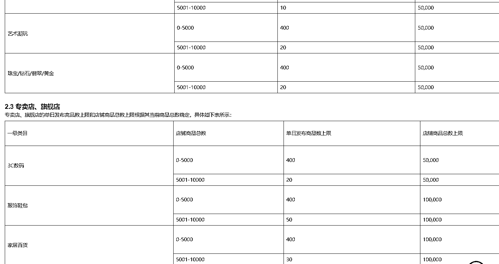

# 继百万免佣后，小红书单店可上数万品，铺货机会来了

> 原文：[`www.yuque.com/for_lazy/wind/un47tvfzwg82v1tu`](https://www.yuque.com/for_lazy/wind/un47tvfzwg82v1tu)

作者： 凌州

日期：2025-09-05

点赞数：**15**

* * *

正文：

小红书单店可上 5-10 万个品 店铺以 5000 为阈值，5000 以下每天上限都是 400 个，对于铺店群的玩儿法来说又是一个利好消息
前有 9 月 1 号开始的百万免佣计划，今有单店单天上品 400 个，小红书这波要狠狠发力啊
除了商品本身的店群机会卖铲子也同样能赚钱，面对这么大的量蚂蚁搬家每个月最高只能上一千个，那要是出那种一个月搬五千个的，就算它在那里不停的搬个两三天上满，肯定也有市场

* * *

评论区：

亦仁 : 感谢分享，已中标

凌州 : 哇噻又中了！感谢老大😁

* * *

公众号懒人搜索，[懒人专属群分享](https://lazybook.fun/#/blog/group)