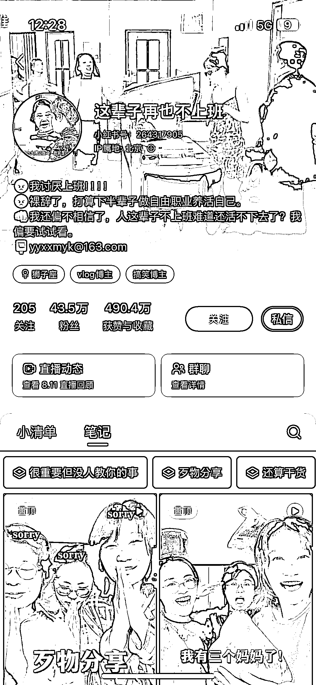
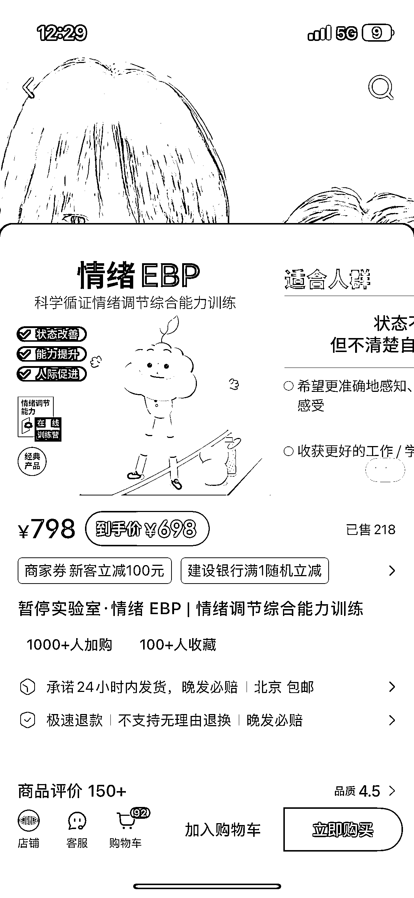
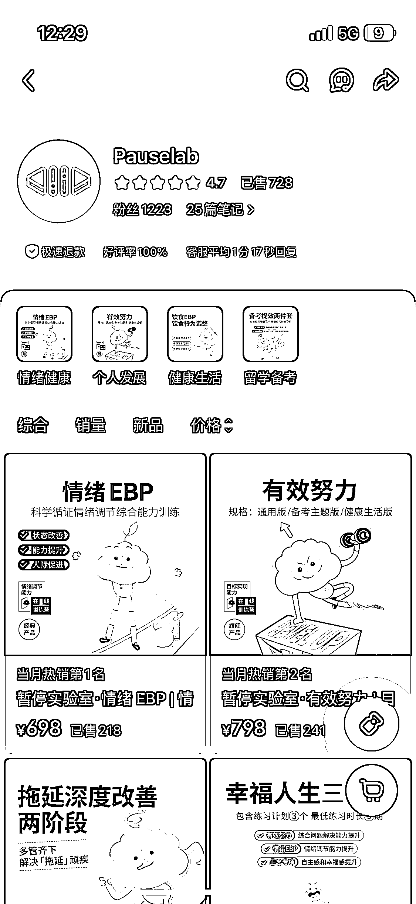

# 情绪实验室案例：高单价课程，靠体系化解决用户痛点

> 原文：[`www.yuque.com/for_lazy/wind/wewlgi8yrnagqlly`](https://www.yuque.com/for_lazy/wind/wewlgi8yrnagqlly)

作者： 子蓝

日期：2025-08-29

点赞数：**16**

* * *

正文：

看到这个博主一条视频在推荐这个情绪实验室的产品，
首先视频是博主讲述自己遇见一件事，原本是 a 做法，后面因为上了这个课程变成 b 做法，主要内容也是人际关系父母课题激起的情绪如何处理，用这个产品解决了问题，
看了下产品单价还是很高的，主要是产品是成体系，有理论有实操有作业，这个是知识付费的好思路，通过 ai 帮助生成一个体系能带领用户实操，封面也是可以 ai 生成，
现在大家对情绪焦虑、迷茫的解决需求很大，是个好市场，把自己的痛点通过方法论解决，再把方法论生成体系产品售卖

* * *

评论区：

陈零 : b 站有特别多 up 在带，包括 lks 这种大 V，说明盈利很好

亦仁 : 感谢分享，已中标

* * *

公众号懒人搜索，[懒人专属群分享](https://lazybook.fun/#/blog/group)