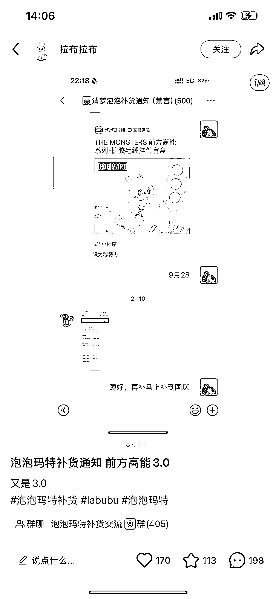
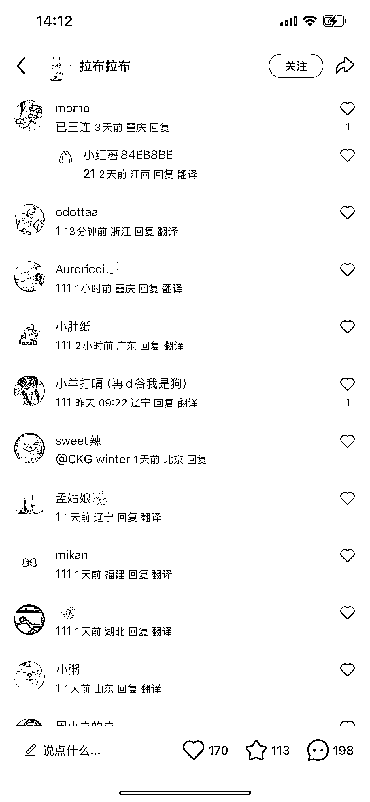
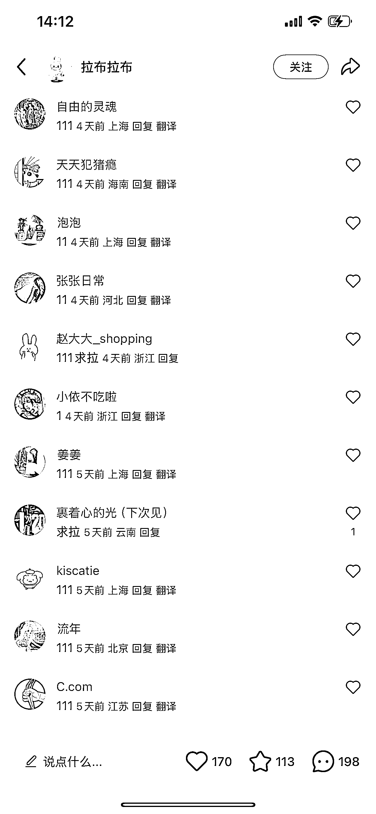

# Labubu 抢货提醒引流私域社群，短期、中期、长期的变现机会

> 原文：[`www.yuque.com/for_lazy/wind/qeedcmxlc7idbn2a`](https://www.yuque.com/for_lazy/wind/qeedcmxlc7idbn2a)

作者： 冯小夏

日期：2025-09-04

点赞数：**30**

* * *

正文：

项目：通过 Labubu 抢货提醒引流私域社群
背景：目前 Labubu 热度未退，闲鱼又假货泛滥，因此很多人在蹲官方的补货。但是官方补货时间不定，经常错过，所以抢货通知群应运而生。
机会点：看了下小红书的帖子，评论里全都是求拉进群的，而且持续都在新增。是不错的引流私域的入口。 这是一个 的引流点，短期适合通过 变现，中期切入 ，长期做
。Labubu 热度可能衰减，需要快速扩展到其他 IP。 短期变现机会： ：单纯的“补货提醒群”就有价值，用户愿意付费加入（比如一次性收 9.9
或月费）。因为稀缺、抢手，时间敏感，刚需度高。 ：群里除了提醒，还可以推荐靠谱代购、正版渠道，赚取佣金。比如合作某些二级分销。
：做一个自动提醒的 Bot（监控官方店/微信小程序/淘宝上架），提供基础免费+高级付费订阅。 中期变现机会：
：群活跃后，衍生二次消费。比如 Labubu 周边（手办展示柜、防尘罩、拍照背景板）、潮玩配件。
：利用大家都在蹲货，顺带做“安全交易中介”，解决闲鱼假货和信任问题，可以抽手续费。 ：在小红书/B 站做“Labubu 情报号”，变成 KOL，接广告/品牌联名。
长期变现机会： ：先从 Labubu 切入，后续扩展到 ，比如泡泡玛特系列，甚至联名、限量的其他品类，比如鞋类等等。
：付费会员享受专属提醒、渠道折扣、线下活动。 ：逐步导流到自己的小程序店铺，卖正版货源，甚至发展成“潮玩玩家俱乐部”。

* * *

评论区：

亦仁 : 感谢分享，已中标

爱搞钱的宋宋💰 : 还有那种抢演唱会回流票的，也可以做一个插件啥的提醒下，然后让大家付费，这个价格肯定比黄牛票划算，也是一个需求点[嘿哈]

礼新 : 谢谢分享

* * *

公众号懒人搜索，[懒人专属群分享](https://lazybook.fun/#/blog/group)