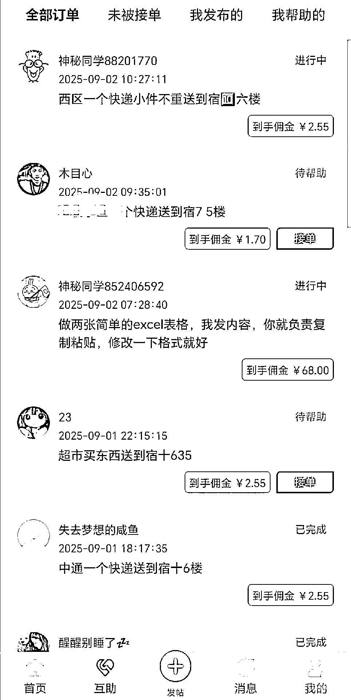
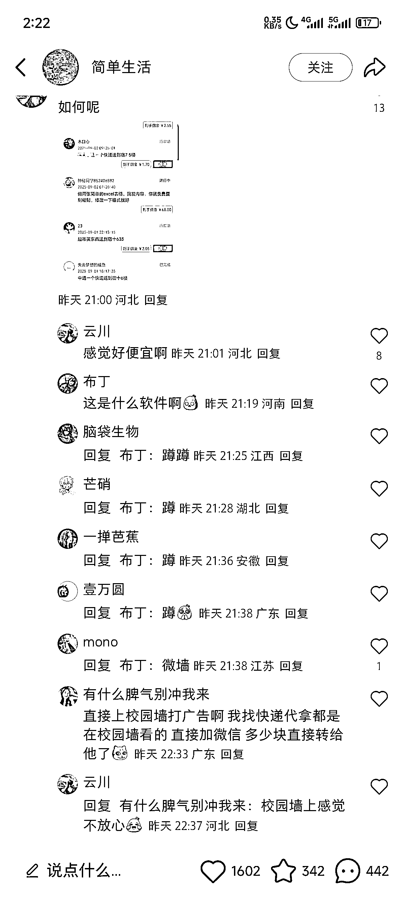
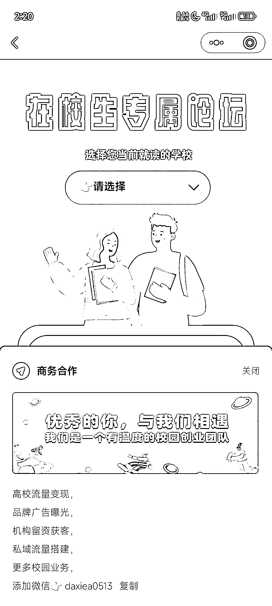
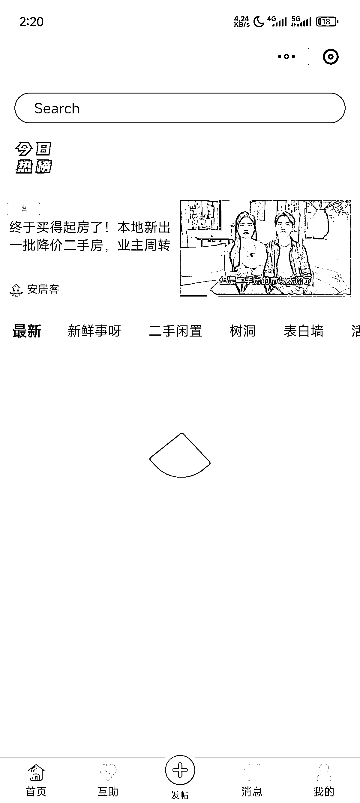

# 从校园墙到小程序：学生专属的赚钱新平台

> 原文：[`www.yuque.com/for_lazy/wind/obu2kugib5f5le2e`](https://www.yuque.com/for_lazy/wind/obu2kugib5f5le2e)

作者： 阿东

日期：2025-09-03

点赞数：**26**

* * *

正文：

小程序-校园微墙，把过去的校园墙变成小程序，可以通过广告变现，合作变现，也可以当学生搞钱的平台。

* * *

评论区：

沐桐 : 怎么实操[色]

阿东 : 用 ai 编程做一个类似的小程序去推广

九歌 : 说不定可以去这里引流，都是大学生

亦仁 : 感谢分享，已中标

伍拾陆 : 感谢分享👍有启发🌹

* * *

公众号懒人搜索，[懒人专属群分享](https://lazybook.fun/#/blog/group)