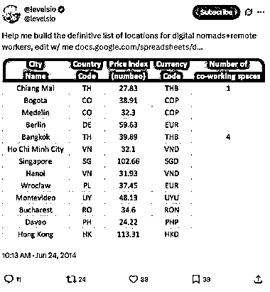
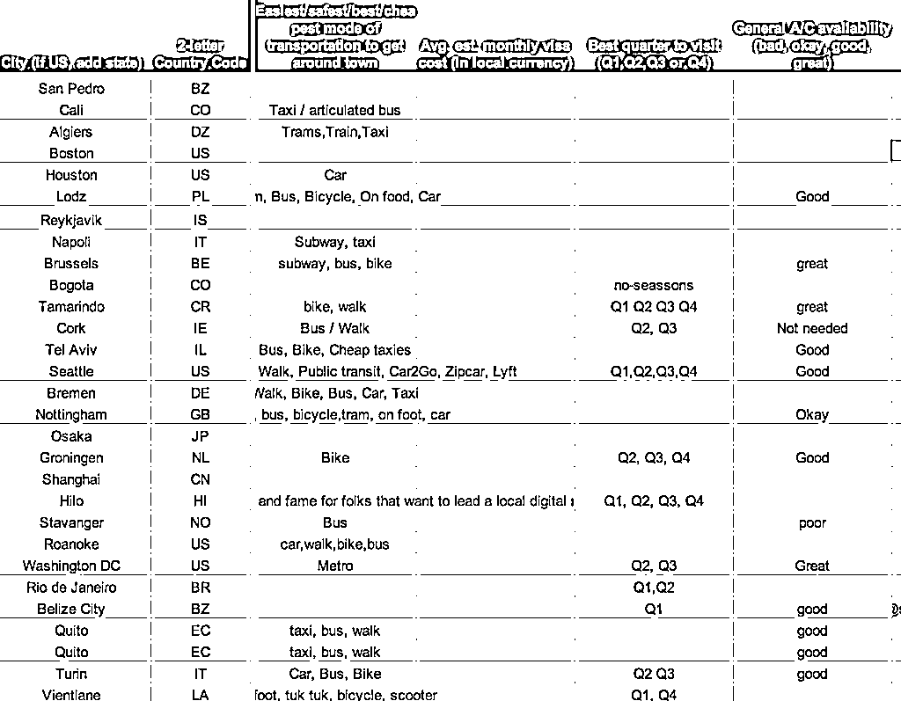
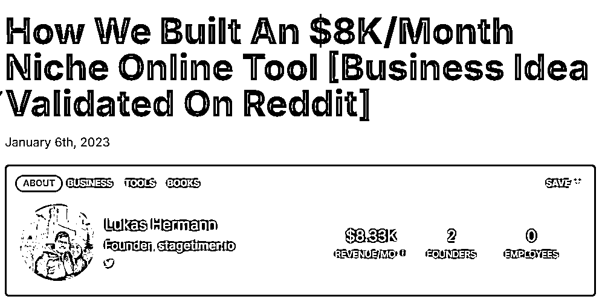
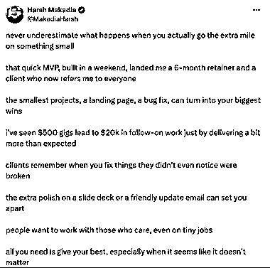

# 只靠一张 Google 表格，他验证了一个年入百万的产品（一个人！！）

> 原文：[`www.yuque.com/for_lazy/wind/gs797g5eb3yh78u0`](https://www.yuque.com/for_lazy/wind/gs797g5eb3yh78u0)

作者： 向上的塔皮

日期：2025-09-03

点赞数：**35**

* * *

正文：

只靠一张 Google 表格，他验证了一个年入百万的产品（一个人！！） 2014 年，Pieter Levels 在旅行时发现。然后他就在 Twitter
（现在的 X）发了一个 Google 表格（图 1）。 “帮我收集适合远程工作和数字游民生活的城市推荐，和我一起编辑”
没想到，短短几天，表格被填满了（可以从图 1 看到贴子数据其实非常低，但是就传播开来了）。网友还用户自发添加了安全指数、咖啡馆密度、LGBTQ
友好度等维度（图 2）。 Pieter 就把表格变成了网站： 这个小网站一上线就登上了 Product Hunt 和 Hacker News
的第一名。有人提出收购，他谈了半年，最后还是决定自己做。他一直坚持“一人公司”的理念，过去偶尔请兼职助手，现在借助
AI，他几乎全程一个人运营，没有融资、没有合伙人。 用 MVP 来验证想法真的是可以的，还有 stagetimer.io
，因为在工作室手动跑来跑去启动计时器，太麻烦，就周末做了超简陋 MVP：一个设备开始，另一个设备倒计时。然后把这免费工具发到 Reddit，结果收到了很多用户反馈（图 3）。现在月入
2 万美金，客户包括微软和宜家。 X 挺多这样的例子的： 用<card type="inline" name="math" value="data:%7B%22code%22%3A%220%20landing%20page%20%2B%20Stripe%5Cncheckout%E6%B5%8B%E8%AF%95%E6%83%B3%E6%B3%95%EF%BC%8C3%E5%A4%A9%E5%86%85%E8%8E%B7%E9%A6%96%E5%8D%95%EF%BC%88%E5%9B%BE4%EF%BC%89%E3%80%82%20%E5%91%A8%E6%9C%AB%E7%94%A8%E7%AE%80%E5%8D%95%E5%B7%A5%E5%85%B7%E6%9E%84%E5%BB%BAMVP%EF%BC%8C%E8%8E%B76%E4%B8%AA%E6%9C%88%E5%90%88%E5%90%8C%E5%92%8C%22%2C%22id%22%3A%22pPXd5%22%7D">20k 后续工作（图 5）。 [`nomads.com/`](https://nomads.com/)[[`www.starterstory.com/stories/stagetimer-`](https://www.starterstory.com/stories/stagetimer-) io-11b472c9-5746-4fea-
ae5f-8c82cd389346]([`www.starterstory.com/stories/stagetimer-`](https://www.starterstory.com/stories/stagetimer-) io-11b472c9-5746-4fea-
ae5f-8c82cd389346)[`x.com/AhmedZulfiqr/status/1961419932177994189`](https://x.com/AhmedZulfiqr/status/1961419932177994189)[`x.com/MakadiaHarsh/status/1962107800454070504`](https://x.com/MakadiaHarsh/status/1962107800454070504)</card>

* * *

评论区：

沐桐 : 这么厉害的吗，好想学会[色]

Katao : bulid in public

亦仁 : 感谢分享，已中标

伍拾陆 : 感谢分享👍已点赞➕收藏🤓

* * *

公众号懒人搜索，[懒人专属群分享](https://lazybook.fun/#/blog/group)