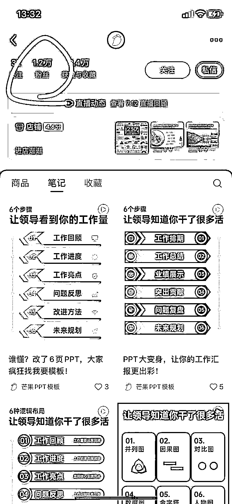

# 赛道-细分方向：最简单的 PPT 模板也能低粉高变现！

> 原文：[`www.yuque.com/for_lazy/wind/bqcli919bwk1vq2g`](https://www.yuque.com/for_lazy/wind/bqcli919bwk1vq2g)

作者： 飞掌柜

日期：2025-09-03

点赞数：**21**

* * *

正文：

一、案例描述（账号/项目/打法/现象） 1、该账号主要卖 PPT 模板，通过小红书图文或视频引流，图文可以用稿定设计+AI 完成，视频可以用剪映完成。
2、一开始是单账号，目前是多账号矩阵玩法。 3、每做 20 多条就有一条大爆款，涨粉大几千，商品带货也很厉害。 二、数据表现（播放量、GMV、截图等）
1、该账号我追踪了半个多月，日常作品只有几十个点赞，但是每做 20 多条之后，就有一条爆款，第一次爆款是 1600 多点赞，播放量十几万了；第二次爆款是 5500 多点赞，播放量五六十万了。
2、评论区清一色都是求模板的，40 来个作品就已经涨粉 6400 多，获赞与收藏 2.4 万！
3、已经开通商品带货，只有一个产品，就是年终汇报 PPT 模板，定价 39.9，可以领取 10 元优惠券，已经卖出 373 份。
三、机会剖析（初步判断：比如 ROI 高、成本低、可复制性强）
1、PPT 模板网上到处都是，搜集并不难，整理分类好上架即可，可以按照场景分，比如工作汇报、论文答辩、年度总结等。
2、封面图可以用 AI 制作，或者稿定设计，目前很多设计软件都有 AI 提升效率的功能，或者花时间做好一个，其他作品套用模板，更换文字即可。
3、除了开通商品带货，还可以矩阵化玩法，比如我第一次看到该账号，还没有矩阵，目前已经新开一个账号，涨粉 1.2 万，同时在卖 PPT 模板，通过商品可以点击进入另一个账号，按照这种方法，可以开第三个，第四个。
4、当然，结合知识付费，引流私域变现也可，同时增加 PPT 代制作订单，也能放大收入！

* * *

评论区：

亦仁 : 感谢分享，已中标

飞掌柜 : 感谢老大，继续努力[呲牙]

* * *

公众号懒人搜索，[懒人专属群分享](https://lazybook.fun/#/blog/group)