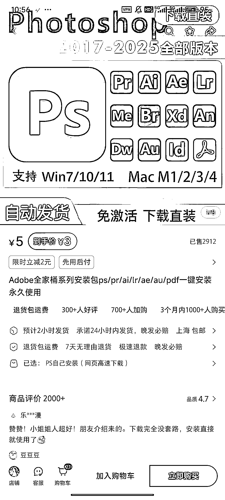
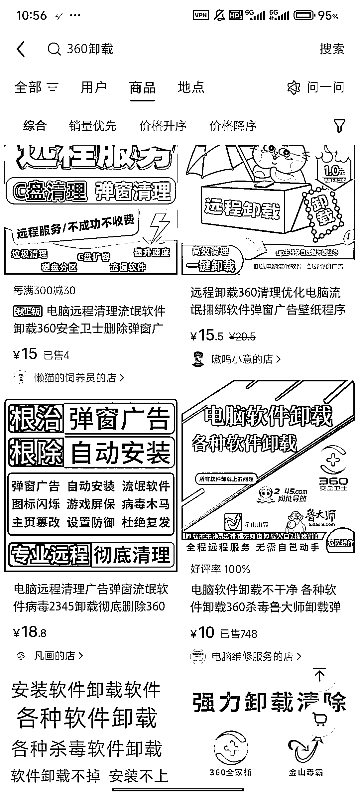
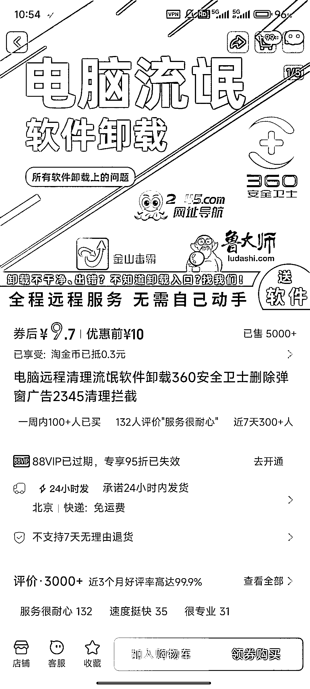
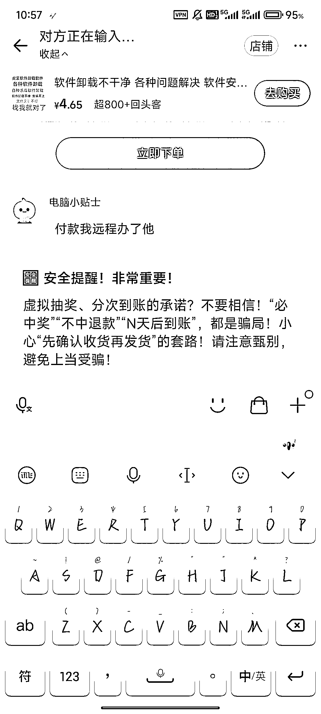
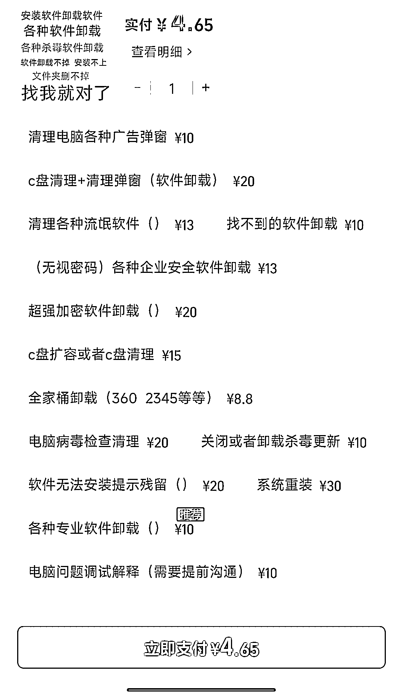

# 从卸载到代装：淘宝代装软件，客单价 1 块，销量 10w+

> 原文：[`www.yuque.com/for_lazy/wind/vngbikto7shpr8u3`](https://www.yuque.com/for_lazy/wind/vngbikto7shpr8u3)

作者： 小武

日期：2025-09-02

点赞数：**21**

* * *

正文：

一个很小但很痛的需求：卸载 360。 刚刚在刷小红书的时候，看到一个评论说自己卸载流氓软件最快的方式就是去淘宝找人卸载。 我一看淘宝的价格和销量确实很可以呀。
其实还可以做一些软件的下载，比如 ps，pr 这些。 我记得我当初下载这些也是跟着教程做了好几遍，因为大家都不是下载正版的，所以大家懂的
那大家还可以利用编程给自己做一个类似的网站，帮大家代下载/安装些软件等

* * *

评论区：

礼新 : 这种安装软件我也会，竟然也能赚钱[微笑]

亦仁 : 感谢分享，已中标

* * *

公众号懒人搜索，[懒人专属群分享](https://lazybook.fun/#/blog/group)