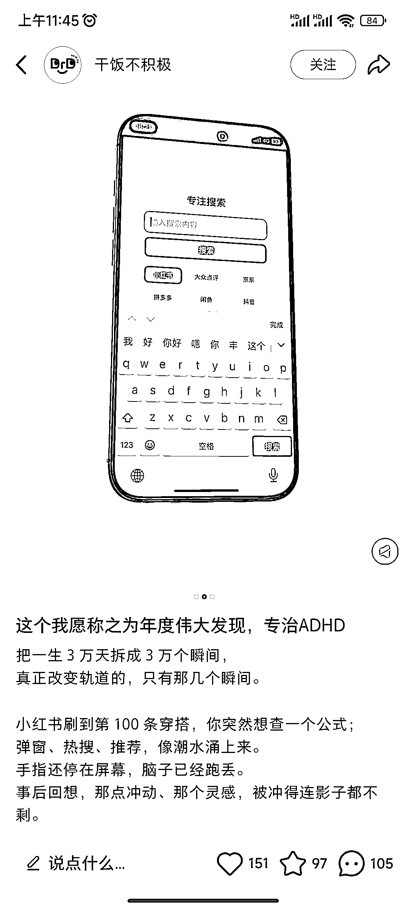
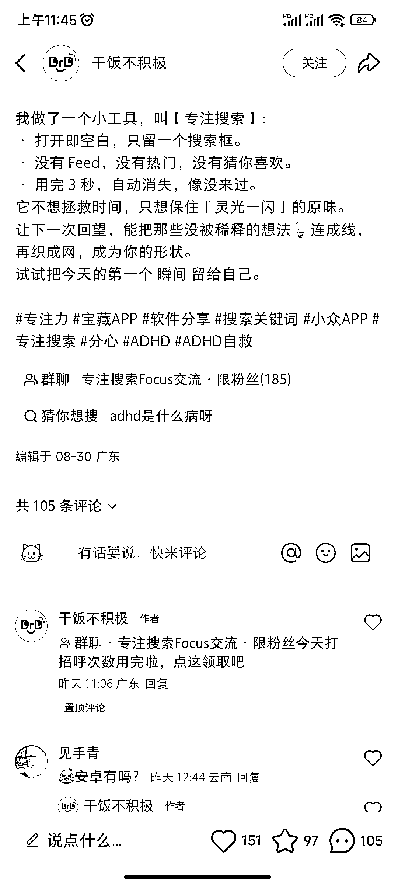
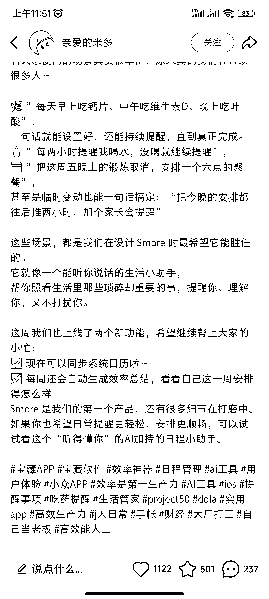
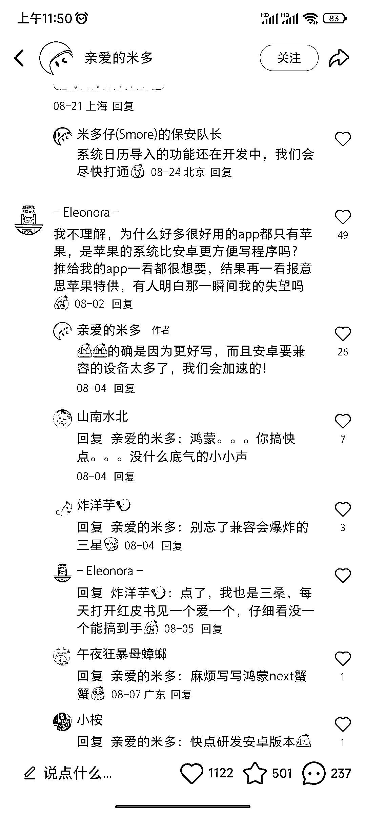

# 很多 App 只有 iOS 版，对应的安卓需求是大空白

> 原文：[`www.yuque.com/for_lazy/wind/swmlzw5w1kz9qdu1`](https://www.yuque.com/for_lazy/wind/swmlzw5w1kz9qdu1)

作者： 瘦晓白

日期：2025-09-05

点赞数：**9**

* * *

正文：

可制作对应的安卓应用 看到两款 app 的笔记， 一款是专注搜索的，解决注意力分散问题。
比如我每次打开 app 是想搜东西的，结果进来后被推荐被关注吸引，就浏览起来，忘了自己要搜什么了。 这个 app 就是解决这个问题的。
另一款是提醒的，日常喝水，吃营养品，吃药等很容易忘记的事情。
评论区提到好多 app 都是 ios 版的，国内用安卓手机的蛮多的，需求是大众的，如果有对应安卓的开发出来，收一些会员费，或者是加入广告都可以的。

* * *

评论区：

亦仁 : 感谢分享，已中标

瘦晓白 : 谢谢亦仁🌹

小薛 : 安卓盗版猖獗

* * *

公众号懒人搜索，[懒人专属群分享](https://lazybook.fun/#/blog/group)