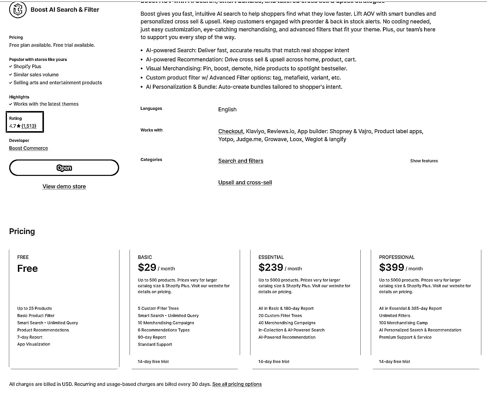
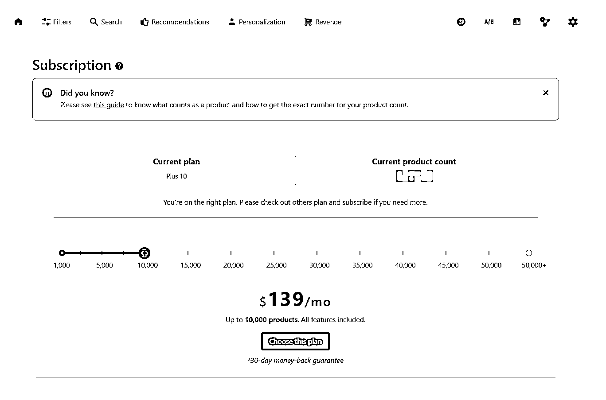

# Shopify 有免费插件，但老外宁愿花$5k 买，只因怕体验差

> 原文：[`www.yuque.com/for_lazy/wind/fx56gxusf1b97g43`](https://www.yuque.com/for_lazy/wind/fx56gxusf1b97g43)

作者： 郭先生 0505

日期：2025-08-31

点赞数：**15**

* * *

正文：

shopify 独立站插件开发 最近接手老外的独立站网站优化，发现他们每个月至少在 filter 插件上面花费了$5K 美金，而且是长期付费，使用的插件是
我跟他们在聊的过程中发现，他们的需求只是对产品做筛选功能，并且他们并不知道 shopify 有免费的插件可以使用。即使我跟他们说了有免费的，但是他们还是犹豫
免费的会不会体验感不好 # #

* * *

评论区：

亦仁 : 感谢分享，已中标

郭先生 0505 : 谢谢老大[抱拳]

* * *

公众号懒人搜索，[懒人专属群分享](https://lazybook.fun/#/blog/group)