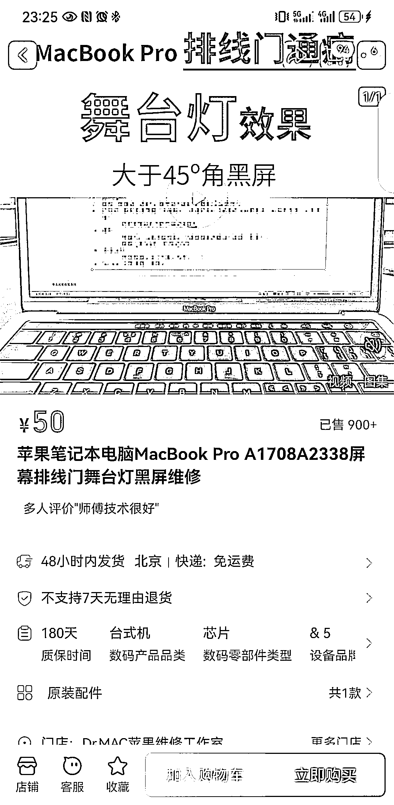
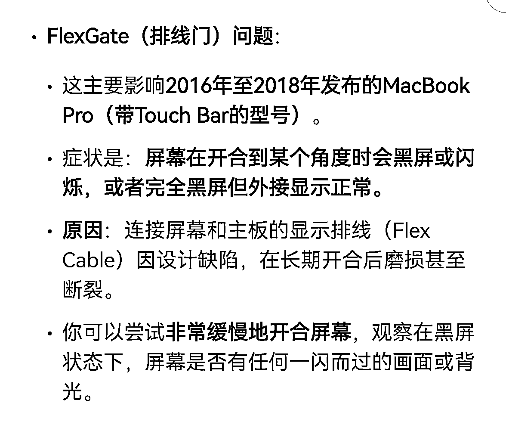
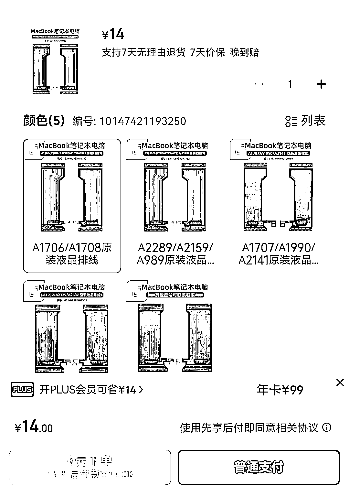

# 一个 MacBook 排线的小需求，销量 900+

> 原文：[`www.yuque.com/for_lazy/wind/zxy1dzcgodbozpeg`](https://www.yuque.com/for_lazy/wind/zxy1dzcgodbozpeg)

作者： Katao

日期：2025-09-05

点赞数：**21**

* * *

正文：

非常垂直，非常小的一个需求，就这一个链接也能赚几十万。 具体：2017 款 MacBook pro 屏幕排线问题，当时苹果有个 touch bar
的创新，为了这个创新，修改了对应工艺，把那个 flex gate
排线做薄了。导致这一批电脑随着使用年限的增加，排线非常容易出问题，导致电脑小角度正常，大角度黑屏。
出现这个问题，很多都过了 5 年保修期。去苹果官方修的话，会直接让你换屏幕总成，要几千块，太贵了。 那就出来这个需求。我不换屏幕总成，只是把这根排线换掉。
就这一个链接，卖了 900 多单。一单的利润 400+。成本：这根排线，京东上买 14 块，收费：收 450，480 块。这一个链接大概就 40 万+的利润。
只要你能解决用户的问题，你就能赚到钱。

* * *

评论区：

亦仁 : 感谢分享，已中标

* * *

公众号懒人搜索，[懒人专属群分享](https://lazybook.fun/#/blog/group)