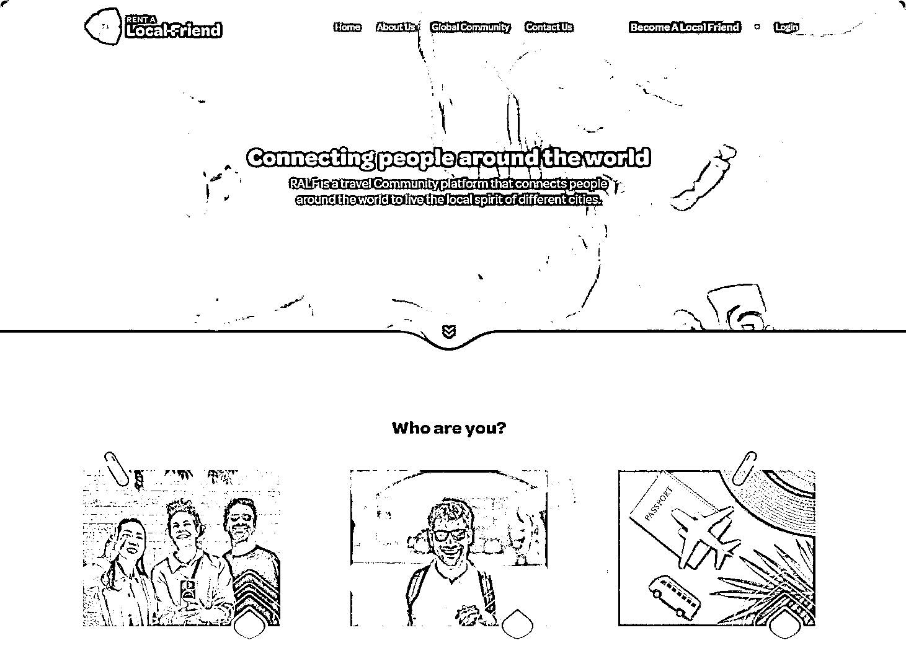

# 利用 AI 工具和老外副业陪聊赚美元，陪老外聊天现在也能变成一门赚钱的生意

> 原文：[`www.yuque.com/for_lazy/wind/adlrpmzkkefpo630`](https://www.yuque.com/for_lazy/wind/adlrpmzkkefpo630)

作者： Miles

日期：2025-10-20

点赞数：**70**

* * *

正文：

利用 AI 工具和老外副业陪聊赚美元，陪老外聊天现在也能变成一门赚钱的生意
在欧美，很多年轻人搬离家乡独居，加上节奏快、压力大，真正能倾听他们的人越来越少。于是，一个新兴行业悄悄崛起：Virtual Friend（虚拟朋友）。
这个职业的门槛几乎为零。不要求学历、不看年龄，也不必是心理咨询师。你只需要会倾听、会聊天，甚至什么都不用说，只要“在线陪伴”，就能赚到真金白银。
国外有不少专门的平台撮合这种需求，其中一个叫
Rentalocalfriend。它原本是“租朋友”服务，分两种：线下导游型（带老外逛城市），和线上虚拟型（纯陪聊）。大多数国人做的，都是线上陪聊。
收入有三部分。第一，是聊天时薪。一般在 20–50 美元每小时。第二，是小费。第三，是顺带推荐产品。现在连英语不好都不是问题了。AI
已经把这门生意变得“人人可上手”。

* * *

评论区：

亦仁 : 感谢分享，已中标

鸟哥 : 牛叉

* * *

公众号懒人搜索，[懒人专属群分享](https://lazybook.fun/#/blog/group)