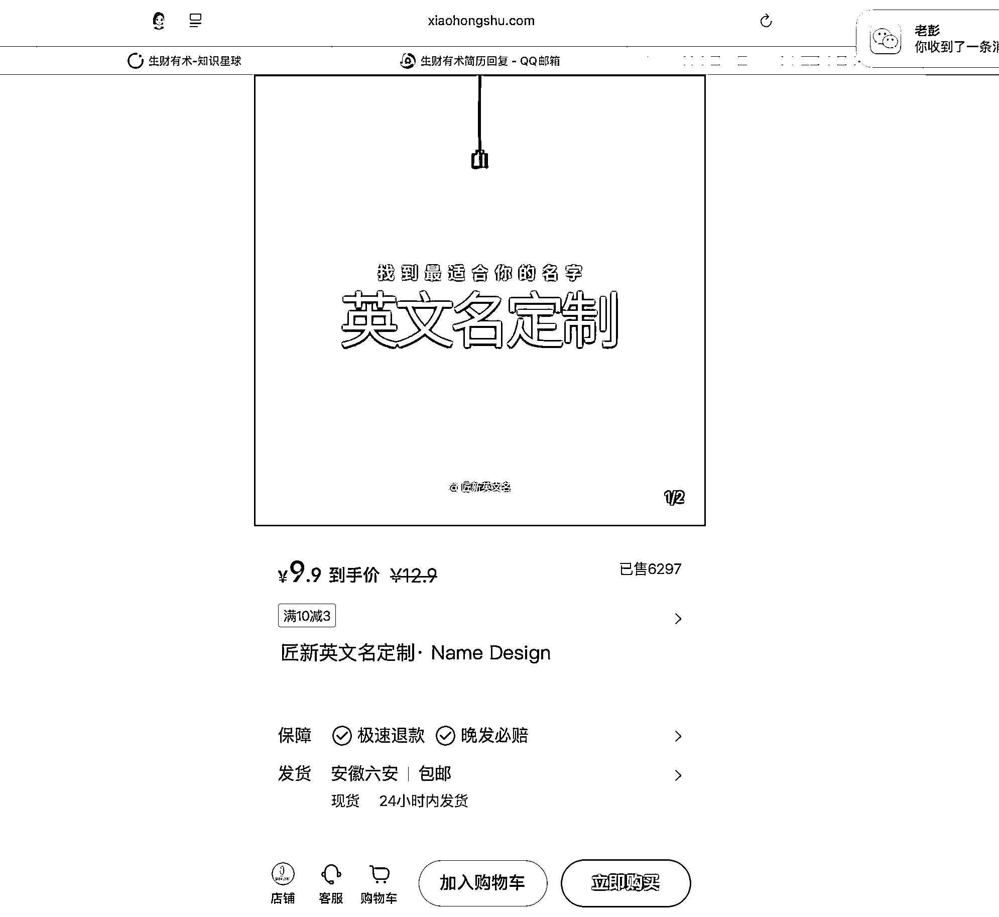
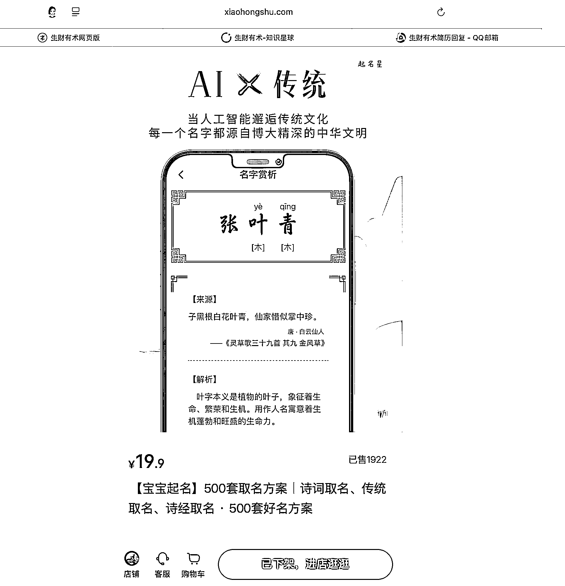
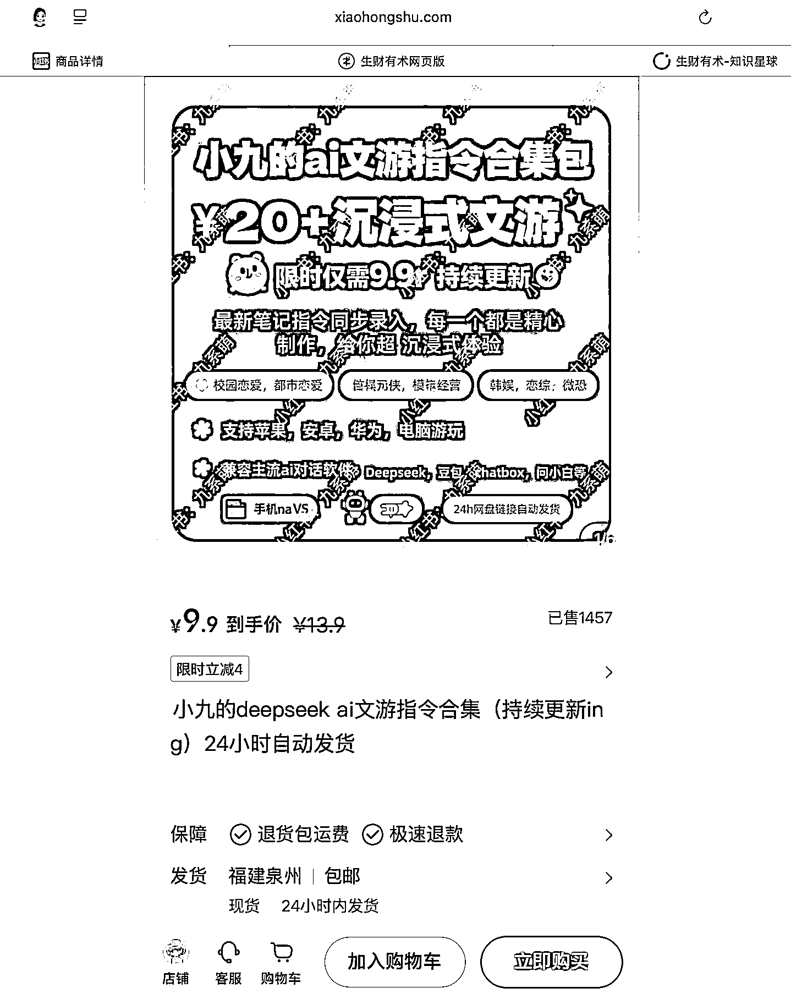
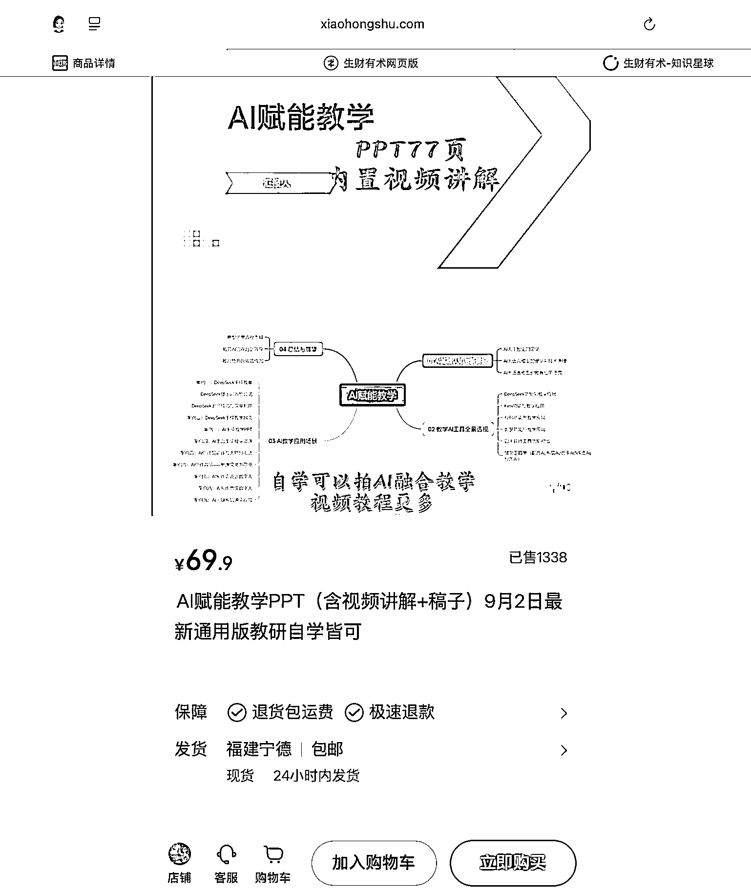
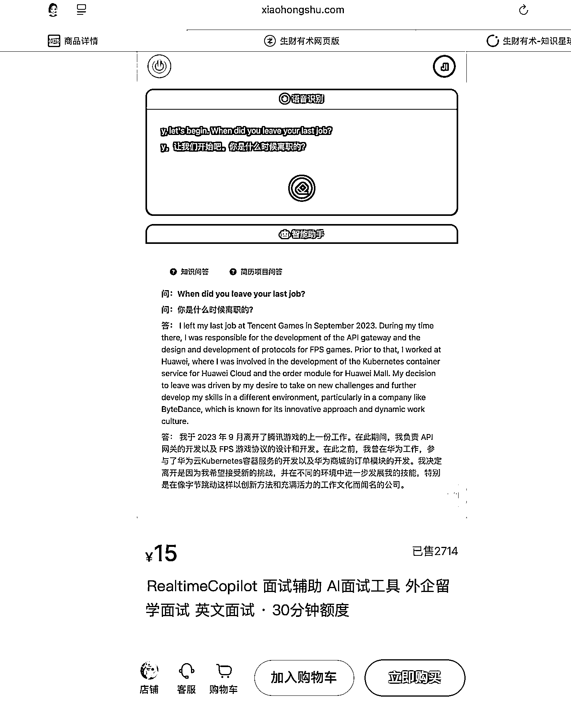
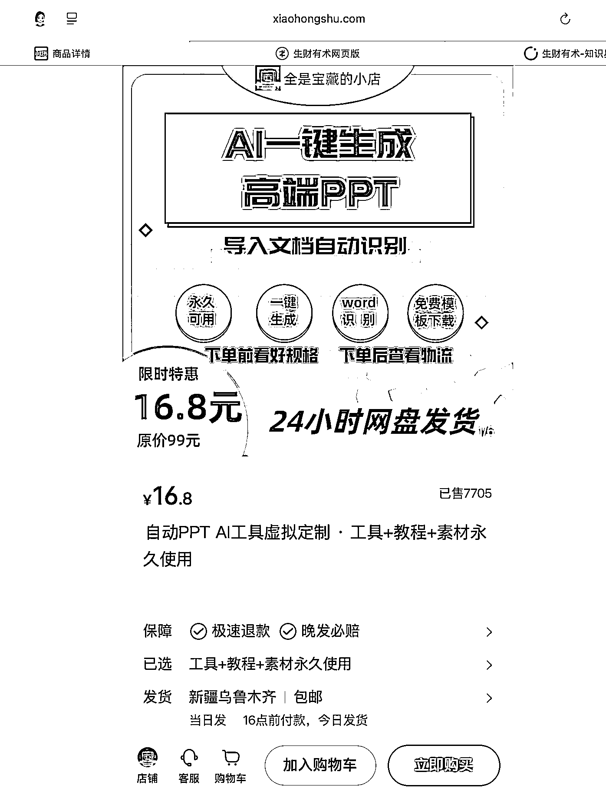

# 小红书一批 AI+虚拟产品店铺案例，圈友做电商可参考

> 原文：[`www.yuque.com/for_lazy/wind/ucqc9k1f5n8g5n5o`](https://www.yuque.com/for_lazy/wind/ucqc9k1f5n8g5n5o)

作者： 馆主

日期：2025-10-17

点赞数：**61**

* * *

正文：

产品 ｜异常值 在小红书上挖掘出一批做 AI+虚拟产品的店铺，做小红书-AI 虚拟电商的圈友可以参考 图 1/该产品做英文名定制，可借 AI
实现且易操作，核心学找需求与定制必要性，是否适用于外企场景？ --该产品变现：22136¥
图 2/假如你想做 AI 虚拟产品，没有思路，可以看看这个案例；AI+场景，比如起名这个场景，就非常非常有用。 --该产品变现：22148¥
图 3/卖 AI 游戏提示词 --该产品变现：9300¥ 图 4/老师是 AI 重度需求用户，针对老师不同场景且学科，开发带教类的虚拟产品 --该产品变现：8.9w
图 5/外企留学互联网大厂刚需！AI 面试听不懂怎么办，小抄工具一次开发，无限变现 --该产品变现：3.7w
图 6/AI 一键生成 PPT？市面上那么多比你好用的免费软件…信息差 --该产品变现：10.6w

* * *

评论区：

亦仁 : 感谢分享，已中标

* * *

公众号懒人搜索，[懒人专属群分享](https://lazybook.fun/#/blog/group)