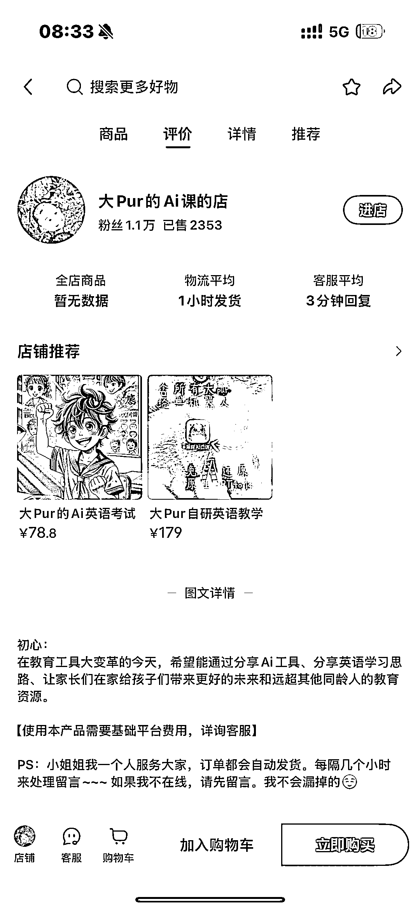
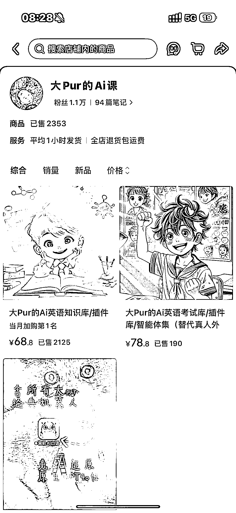
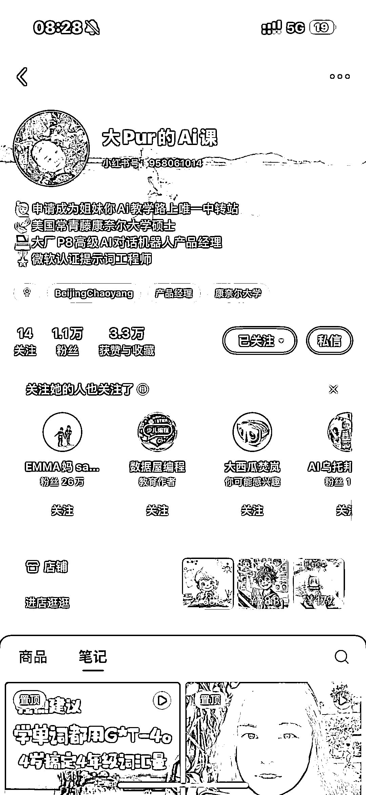
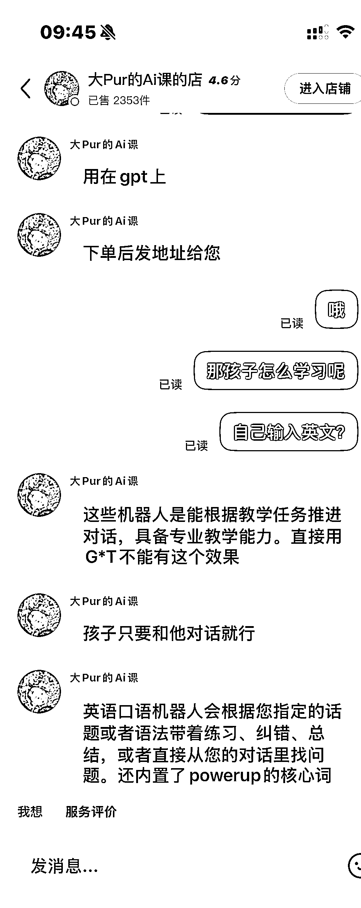

# 小红书创作者用 AI 打造口语陪练助手，2 个月卖 13.6 万的实操拆解

> 原文：[`www.yuque.com/for_lazy/wind/fc1l5q0eo9v55hwl`](https://www.yuque.com/for_lazy/wind/fc1l5q0eo9v55hwl)

作者： 达轮

日期：2025-10-11

点赞数：**48**

* * *

正文：

1.案例描述 在小红书平台上，一位创作者针对“少儿英语口语练习”这一细分痛点，利用 ChatGPT 自行训练的语音互动模型，打造了一个 AI 口语陪练助手。
该产品主打“让孩子在家练口语，也能像和外教对话一样自然”，解决了家长在传统方式中面临的三大难题： 1. 外教课程价格高、排课难； 2. 家长无法持续陪练； 3. 孩子缺少沉浸式口语场景。 创作者通过小红书内容矩阵持续输出“孩子开口说英语”的对比视频，吸引家长购买体验。 ⸻ 2.数据表现 •
售价：68 元 / 套 • 销售量：2000+ 份 • 销售额：约 13.6 万元人民币 • 1.1w 粉丝 转化比例高 ⸻ 3.机会剖析 1. 市场空白与刚需并存 少儿英语培训赛道虽成熟，但口语陪练仍存在“高价、低频、不连贯”的痛点。AI 语音模型能提供低成本、随时随地的陪练体验，正好切入家长刚需。
2. 技术门槛降低，内容驱动可复制 使用 ChatGPT 平台的插件，自行让用户输入原文或者截图。 3. 小红书成为教育类产品孵化新阵地
小红书具备强内容种草与信任关系优势，比抖音更容易实现从内容到成交的闭环。教育内容的“前后对比”形式天然具备传播力。 4. 增长与延伸机会 •
产品可扩展为订阅制（月卡/年卡） • 延伸到其他语种或年龄段（如成人口语、少儿中文陪练） • 结合家庭教育、AI 亲子互动方向，打造 IP 型 AI
学习伙伴 有兴趣的圈友了解下。。

* * *

评论区：

亦仁 : 感谢分享，已中标

达轮 : 感谢老大

* * *

公众号懒人搜索，[懒人专属群分享](https://lazybook.fun/#/blog/group)