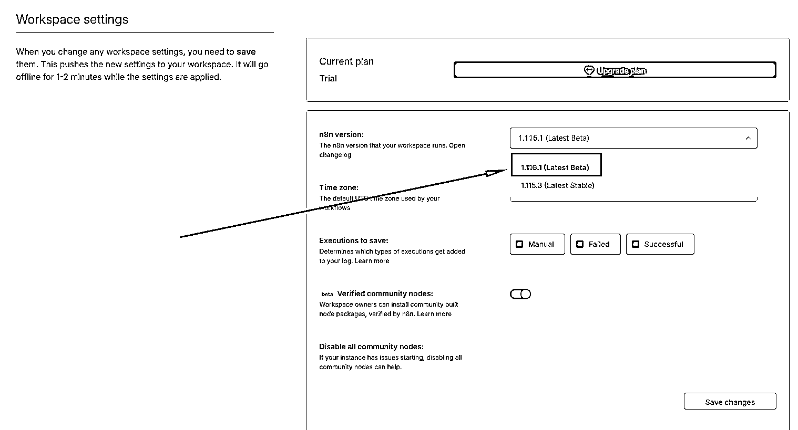
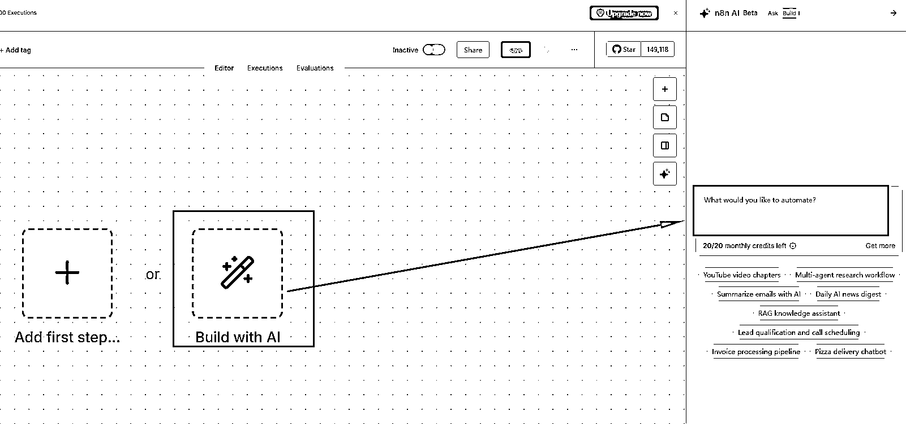
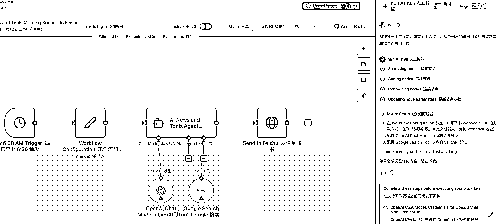

# 官方 n8n 可以使用 AI 自动写工作流了

> 原文：[`www.yuque.com/for_lazy/wind/bm7adungkkfzb8s6`](https://www.yuque.com/for_lazy/wind/bm7adungkkfzb8s6)

作者： 空

日期：2025-10-16

点赞数：**45**

* * *

正文：

官方 n8n 可以使用 AI 自动写工作流了: 1.每月一共 20 个积分，一条工作流需要一个积分; 2.刚测试几个工作流，完成度 90%左右。
3.目前只能在官方服务器上使用，需要升级到 1.116.1 版本; 4.本地还没有这个功能，估计不久本地部署的也可以使用。

* * *

评论区：

亦仁 : 感谢分享，已中标

item : 自己把这块承包了最有优势

* * *

公众号懒人搜索，[懒人专属群分享](https://lazybook.fun/#/blog/group)