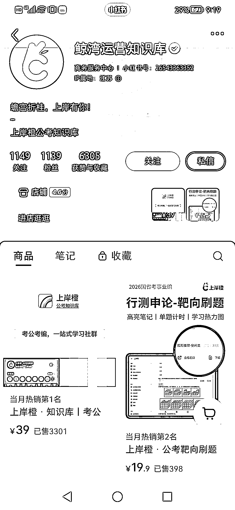
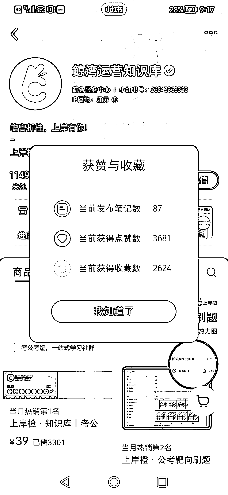
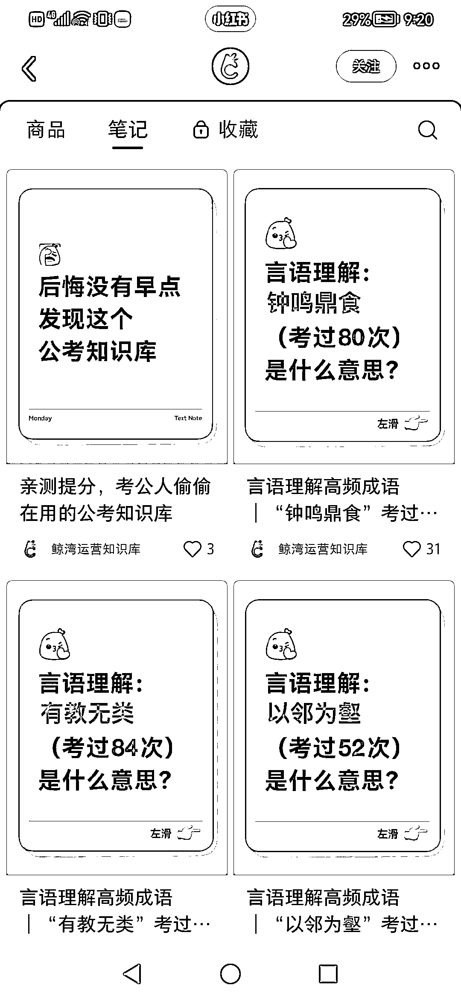
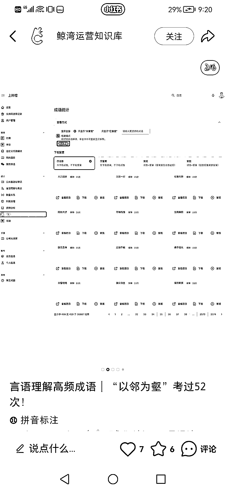
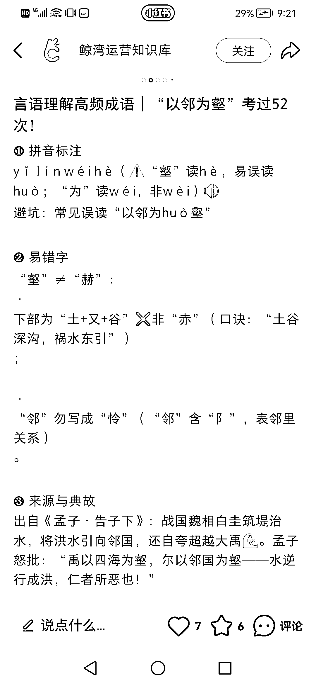

# 小红书卖考公知识库，靠 87 篇笔记赚了 13.6 万！

> 原文：[`www.yuque.com/for_lazy/wind/ptngokx4u04p42fp`](https://www.yuque.com/for_lazy/wind/ptngokx4u04p42fp)

作者： 小岩

日期：2025-10-16

点赞数：**45**

* * *

正文：

小红书卖考公知识库，靠 87 篇笔记赚了 13.6 万！！ 笔记封面用的几乎都是同一套模板，内页就是知识库的截图，文案一看就 ai 生成的
除了单卖知识库，还可以引流到私域，去分销考公相关的陪跑、网课

* * *

评论区：

烽火 : 低粉，不过知识库确实做的精美全面

亦仁 : 感谢分享，已中标

李词宝 : 这个知识库是哪个平台的呢

烽火 : 飞书

佛渡自渡者 : 这种知识库怎么快速搭建呢

* * *

公众号懒人搜索，[懒人专属群分享](https://lazybook.fun/#/blog/group)