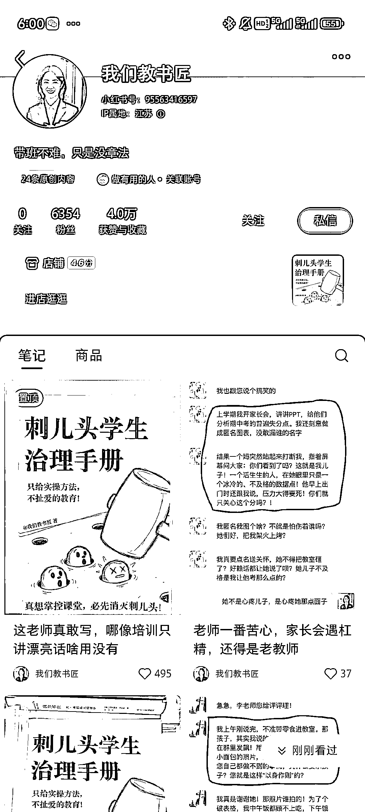
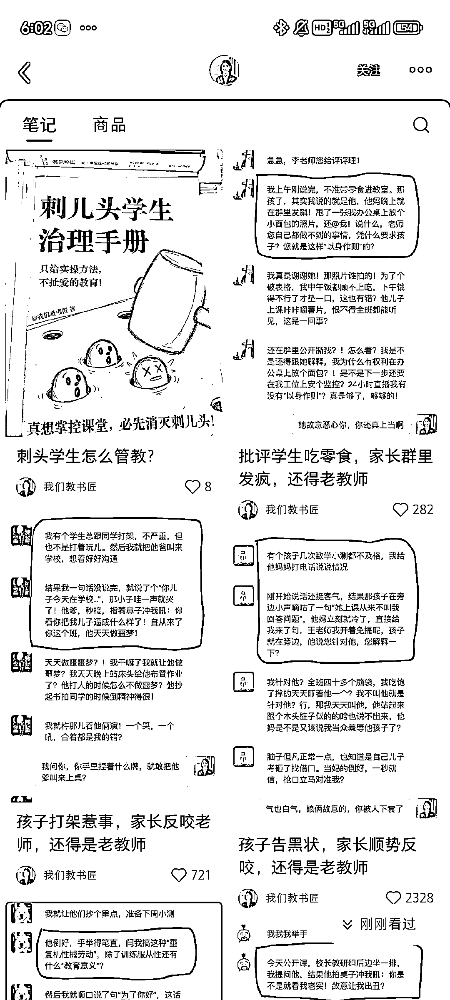
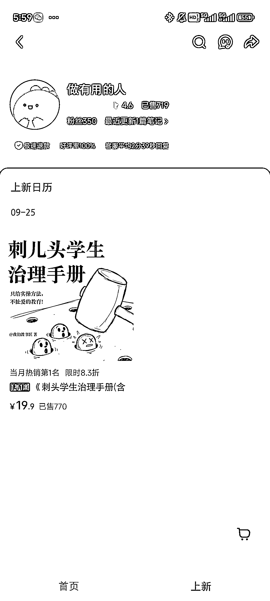
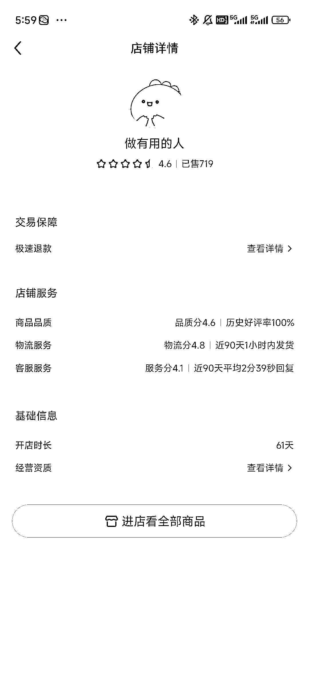

# 小红书虚拟自律手册靠 AI 二创售卖超 1 万五，找需求选品值得思考

> 原文：[`www.yuque.com/for_lazy/wind/sfr525p20mxpeb3v`](https://www.yuque.com/for_lazy/wind/sfr525p20mxpeb3v)

作者： 乌托邦

日期：2025-10-14

点赞数：**42**

* * *

正文：

小红书虚拟自律，刺头学生治理手册，ai 完全能写和二创 目标用户是老师，笔记数据也很好，制造话题，引起争议 9.25 上的品，不到一个月，已经卖 1 万五了
这种找需求的品，值得思考

* * *

评论区：

亦仁 : 感谢分享，已中标

* * *

公众号懒人搜索，[懒人专属群分享](https://lazybook.fun/#/blog/group)