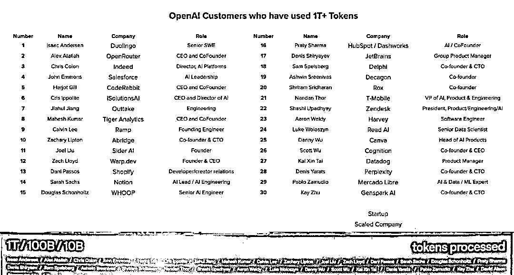
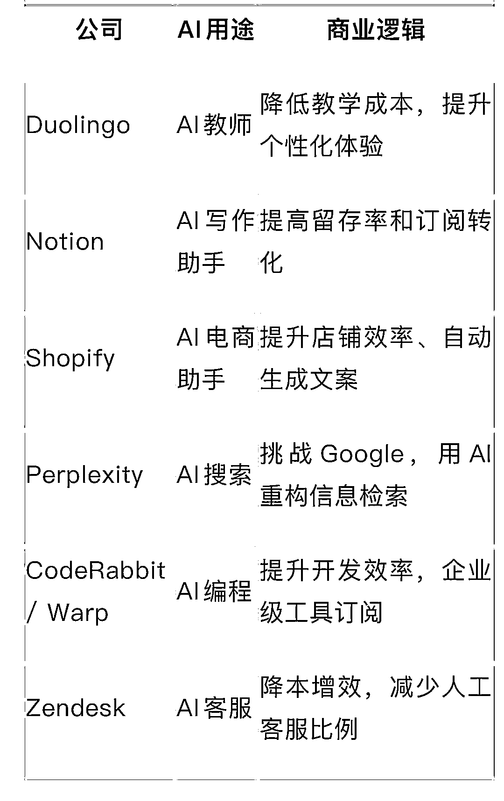
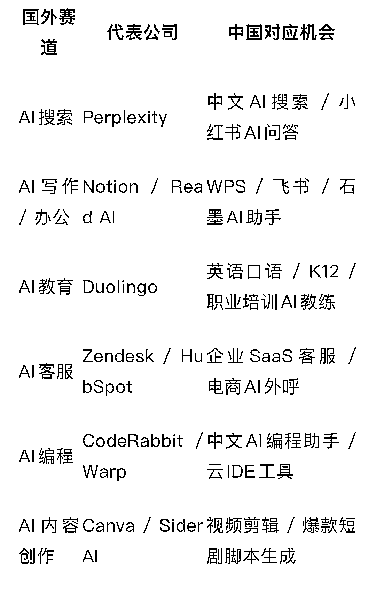
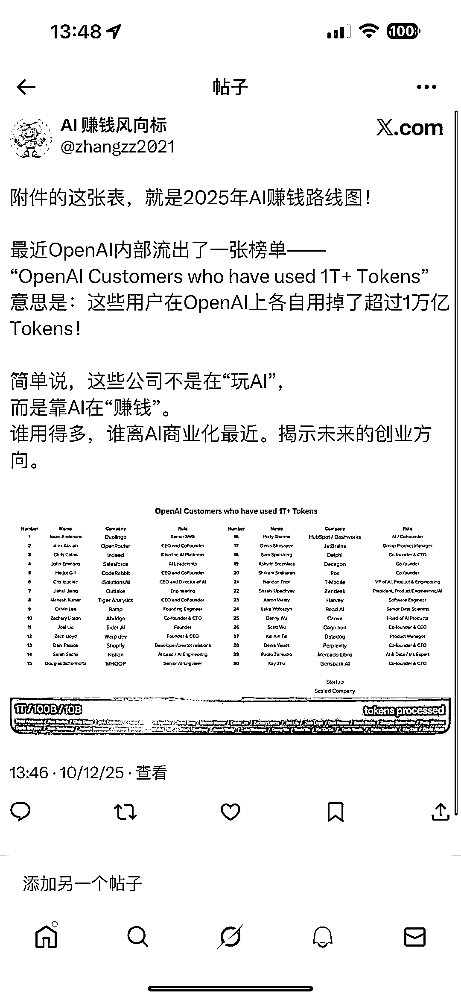

# 全球 30 家公司用 OpenAI 烧出一万亿 Tokens，揭示未来的创业方向

> 原文：[`www.yuque.com/for_lazy/wind/bm6msqx4e45a9t7g`](https://www.yuque.com/for_lazy/wind/bm6msqx4e45a9t7g)

作者： Miles

日期：2025-10-12

点赞数：**40**

* * *

正文：

全球 30 家公司，用 OpenAI 烧出一万亿 Tokens，揭示未来的创业方向 最近 OpenAI 内部流出了一张榜单—— “OpenAI Customers who
have used 1T+ Tokens” 意思是：这些用户在 OpenAI 上各自用掉了超过 1 万亿 Tokens！
简单说，这些公司不是在“玩 AI”，而是靠 AI 在“赚钱”。谁用得多，谁离 AI 商业化最近。揭示未来的创业方向。这些公司有一个共性，都在“用 AI 重做老东西”。没有谁在空谈“颠覆世界”，他们只是把原来的业务，重新装上了 AI 发动机。
AI 不是核心，而是加速器。他们用 AI 去优化一个已经成熟的商业模型，从而让效率翻倍、体验升级、收入持续增长。几乎每个方向都能在中国复刻。只要本地化、垂直化、贴近痛点，就有机会诞生下一个 AI 独角兽。
不需要重新造轮子，只要让 AI 在老赛道里跑得更快。
这，就是最现实的 AI 创业捷径。别再盯着 ChatGPT 怎么更新，去盯那些“用得最狠”的公司。他们的产品，就是你明年的创业灵感。

* * *

评论区：

万维 : 这个应该是公开榜单，不是内部流出的？

亦仁 : 感谢分享，已中标

* * *

公众号懒人搜索，[懒人专属群分享](https://lazybook.fun/#/blog/group)