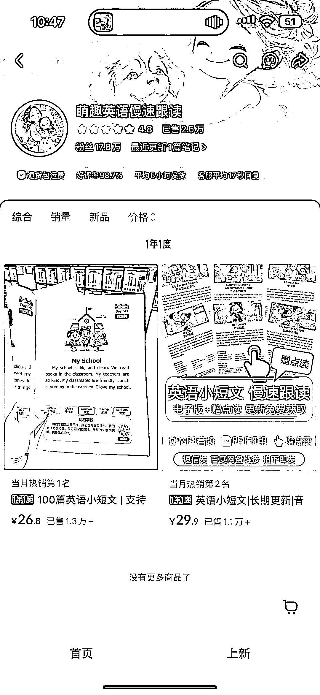

# AI 英语阅读本制作 3 个月利润 1 万+

> 原文：[`www.yuque.com/for_lazy/wind/ggb75haqpml785w0`](https://www.yuque.com/for_lazy/wind/ggb75haqpml785w0)

作者： 虚竹

日期：2025-10-14

点赞数：**48**

* * *

正文：

AI 制作的英语阅读本，3 个月 1w➕。也就是差不多一个月 10w➕利润了。买个彩色打印机和 ai 就可以开搞了。 每日思考

* * *

评论区：

LongQiang : 这种不需要出版图书许可的吗

虚竹 : 看他的标题，a4 大开本，相当于作业本

阿丽 : 感觉有一些风险

LongQiang : 我也觉得这种擦边风险很大，真要做的话最好还是老老实实办许可

虚竹 : 这个店铺也办理了，淘宝 1600 个体➕证件一套

LongQiang : 感谢分享

琳航 : 我买过😂

亦仁 : 感谢分享，已中标

* * *

公众号懒人搜索，[懒人专属群分享](https://lazybook.fun/#/blog/group)