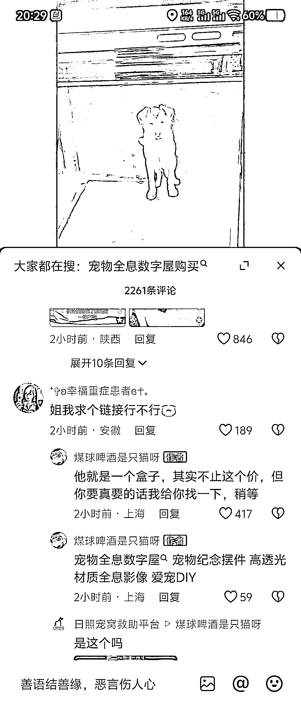
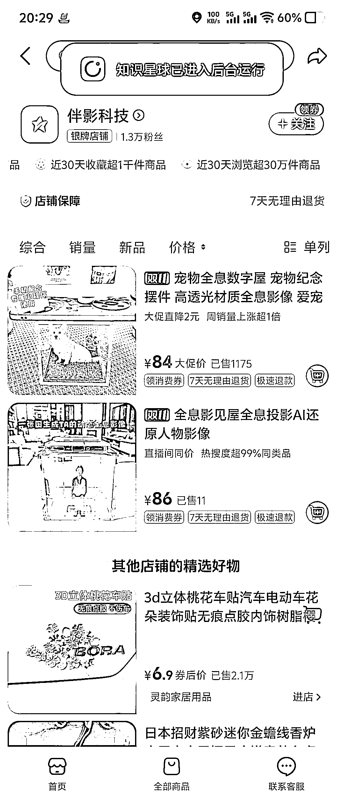

# 宠物数字产品 客户反馈视频 7 万点赞 利润率 80%以上

> 原文：[`www.yuque.com/for_lazy/wind/pa2ea620k5ugfugk`](https://www.yuque.com/for_lazy/wind/pa2ea620k5ugfugk)

作者： 唤山

日期：2025-10-20

点赞数：**38**

* * *

正文：

宠物数字屋，其实产品很简单。 原理是折射手机里的画面，视频是商家做的，根据宠物图片制作特定的动作视频。 ai 可以做到，然后扣一下图，做工作流其实比较简单
就几个亚克力板成本也肯定不高，单价 84，保守估计利润有 80%以上 最近一天客户反馈视频爆了 7 万点赞，评论区一片求购买链接的

* * *

评论区：

感恩学习相信-小陶 : 这个产品真的很能打动人。那是不是可以做成 ai 版，可以看见主人来啦，就开始互动，主人在做事就在睡觉。

唤山 : 那硬件有点难实现，人来和人走可能要一些传感器，而且现在是折射手机视频，如果那样也要有硬件去播放视频，成本变高了不少

感恩学习相信-小陶 : 我想到之前有人花几十万去克隆爱宠。所以如果能够做出来，这个也不失为一种纪念和替代。价格高对于主人来说，可能不在考虑范围。

唤山 : 嗯嗯，那可以尝试

亦仁 : 感谢分享，已中标

* * *

公众号懒人搜索，[懒人专属群分享](https://lazybook.fun/#/blog/group)