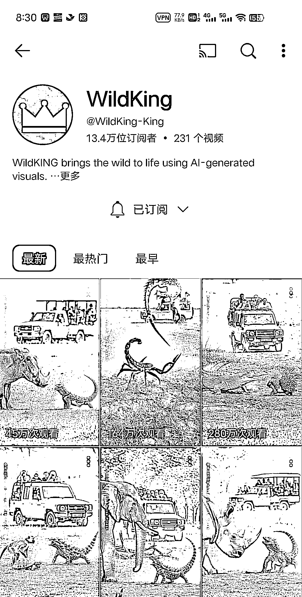
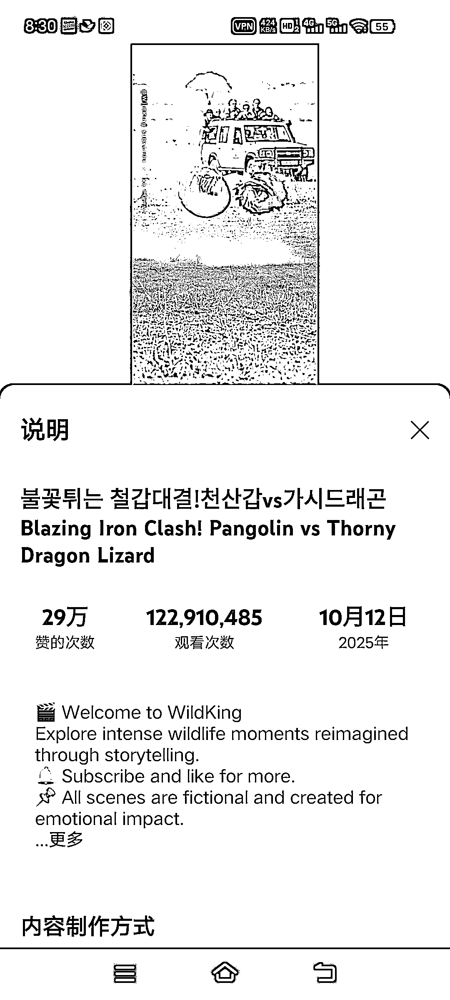
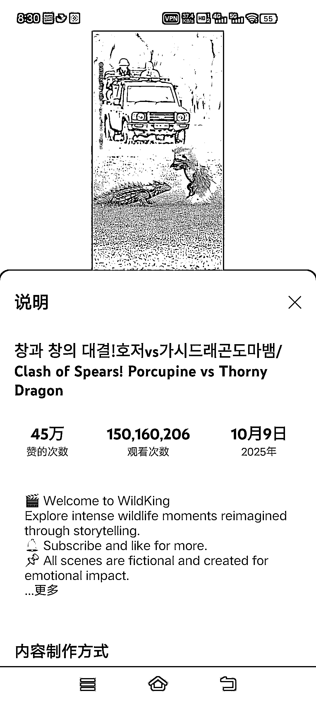

# 动物赛道新兴方向：近期内容实现亿级播放量且竞争较小

> 原文：[`www.yuque.com/for_lazy/wind/rb8fxh28ip2hdf4e`](https://www.yuque.com/for_lazy/wind/rb8fxh28ip2hdf4e)

作者： 澜桉

日期：2025-10-16

点赞数：**37**

* * *

正文：

分享一个我发现的新兴的赛道 是动物的 感兴趣的可以自己去看看 他前几天发的 直接亿播 流量非常大 目前没有多少人做

* * *

评论区：

24K 纯帅 : 昨天试了，动作做不出来，[流泪]

澜桉 : 我今天也试过了，也是效果也不行，我还自己手动调了很多次的提示词，可灵，vidu，veo3.1，sora2 我都试了，做不出来他的效果，可能是 GAS 抽风了，但是我检查了几次，提示词没有问题，但是不知道为什么就做不出来他的效果

澜桉 : 只能说别人多少还是有点实力在身上的

24K 纯帅 : 是不是人家建模的，他的动作是真的浮夸，我给鱼丸要个你的联系方式，交流交流经验？

澜桉 : 行

李词宝 : 看起来像是圈友的作品

459 : 这个场景不完全是 ai 生成的，有自己建模的部分

亦仁 : 感谢分享，已中标

* * *

公众号懒人搜索，[懒人专属群分享](https://lazybook.fun/#/blog/group)