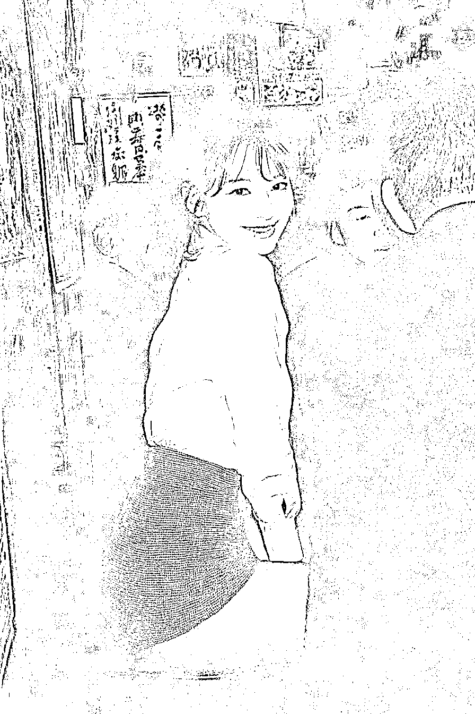
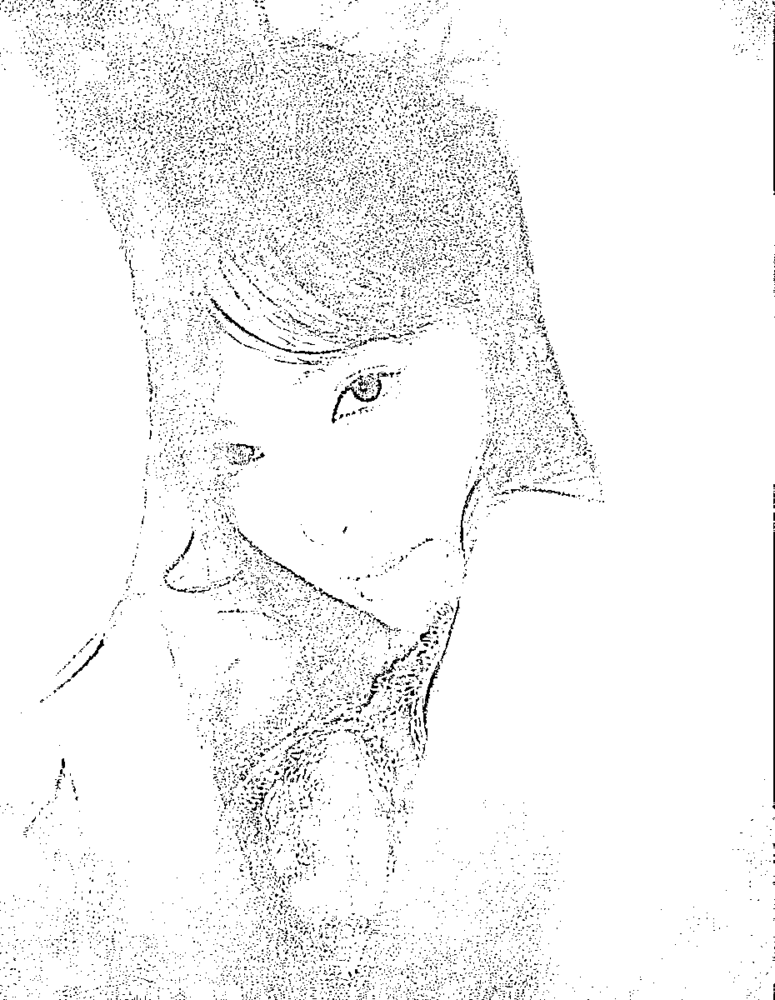

# AI 人像生成技术实现专业级光影构图与情绪控制 启发美学算法量化应用

> 原文：[`www.yuque.com/for_lazy/wind/hucoqbus2zczq0ar`](https://www.yuque.com/for_lazy/wind/hucoqbus2zczq0ar)

作者： 浅笑

日期：2025-10-19

点赞数：**33**

* * *

正文：

mj 生成的人像已经很有艺术感了。 1️⃣AI 生成的人像现在已经具备了接近专业摄影师的光影、构图与情绪控制能力。 2️⃣MJ
带来的最大启发其实是——美学可以被算法量化，AI 写真运用 mj 可以帮助更大。

* * *

评论区：

刘同学 : 我们可以睡瞌睡，但是不可以 sexy

帅彬 : 在群里看到这 3 个图了，原来是你生成的，厉害

亦仁 : 感谢分享，已中标

跑通小闭环✅ : 太真实了吧~

* * *

公众号懒人搜索，[懒人专属群分享](https://lazybook.fun/#/blog/group)