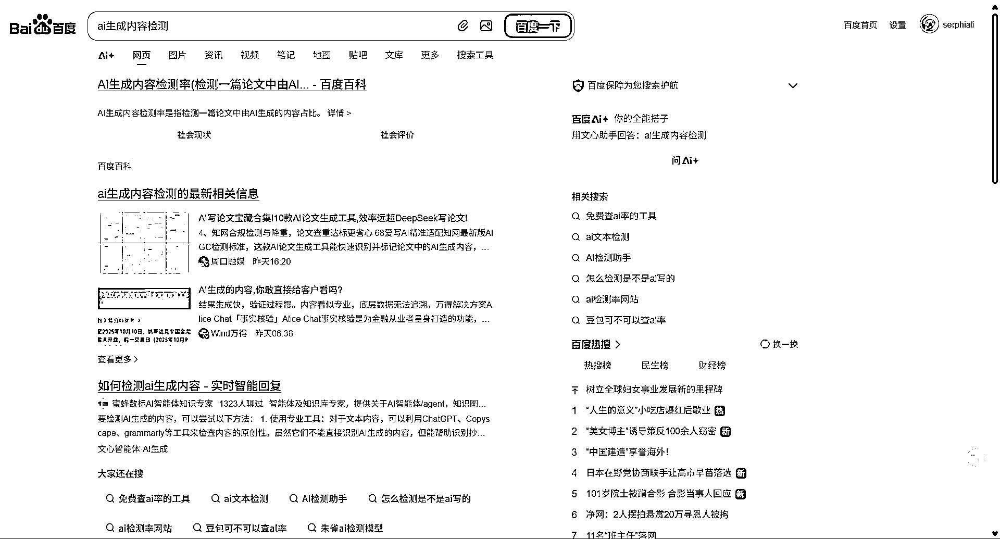

# AIGC 检测网站运营方向：免费检测次数+降 AI 率收费模式探讨

> 原文：[`www.yuque.com/for_lazy/wind/wy20ia9gzqyzqzkl`](https://www.yuque.com/for_lazy/wind/wy20ia9gzqyzqzkl)

作者： Leeka

日期：2025-10-12

点赞数：**37**

* * *

正文：

国内有关 AIGC 检测的网站，真的做得非常烂 同行做得差，但是流量都很好的时候 只说明一个问题，异常值！
但需要记住的是，检测不是目的，降低 AI 率才是，所以可以试着每日检测多少次免费，降 AI 率收费。AI 编程的一个方向分享。

* * *

评论区：

亦仁 : 感谢分享，已中标

程仔 : 论文必备

多西杰克 : 关键是降低 AI 怎么实现？

霞 er : 同问

* * *

公众号懒人搜索，[懒人专属群分享](https://lazybook.fun/#/blog/group)