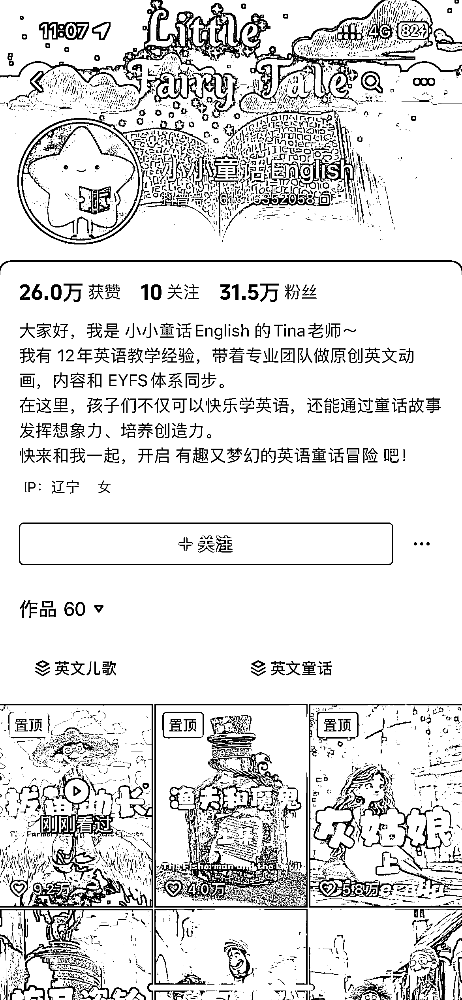
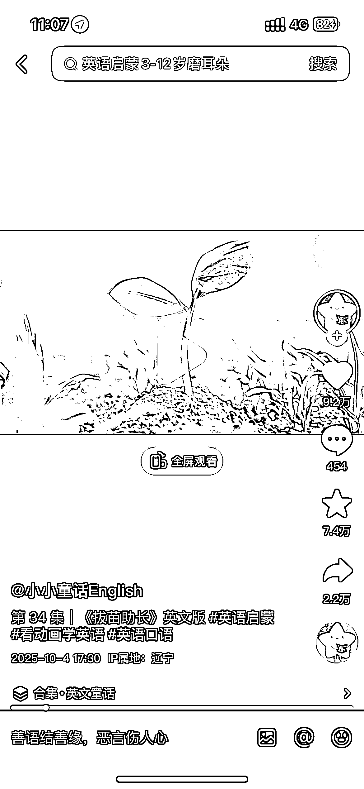

# 儿童英语赛道：AI 制作童话故事视频获 31.5W 粉丝，可带货课程绘本

> 原文：[`www.yuque.com/for_lazy/wind/myay2w182b48xm9c`](https://www.yuque.com/for_lazy/wind/myay2w182b48xm9c)

作者： 漫鱼

日期：2025-10-17

点赞数：**33**

* * *

正文：

这个账号 60 个视频，31.5W 粉丝，用 AI 做英语童话故事来让孩子学英语，有趣又生动，适合做儿童英语这个赛道的，可以卖课，卖绘本等儿童英语相关产品都行。制作过程也可以搭建工作流来完成。

* * *

评论区：

亦仁 : 感谢分享，已中标

* * *

公众号懒人搜索，[懒人专属群分享](https://lazybook.fun/#/blog/group)