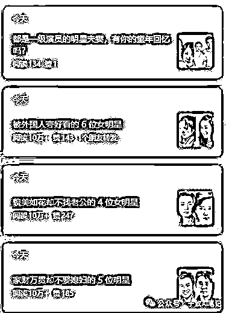
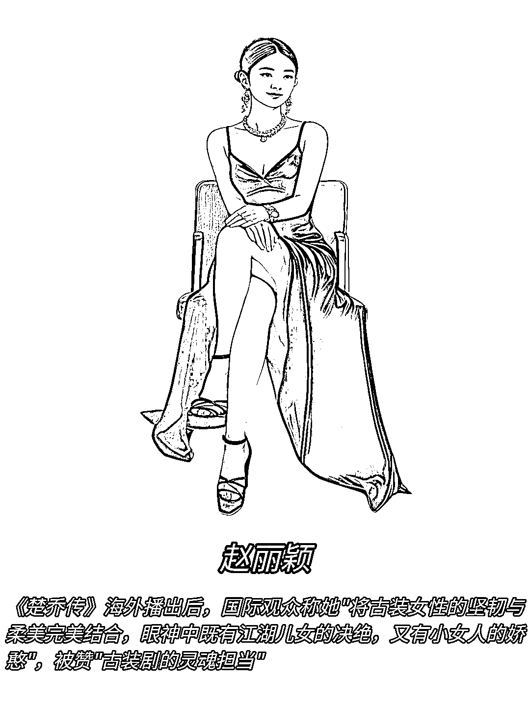

# 公众号 AI 明星漫画 日更 3-4 条 10w+ 一周起号运营攻略

> 原文：[`www.yuque.com/for_lazy/wind/hbwg6mg990wskp66`](https://www.yuque.com/for_lazy/wind/hbwg6mg990wskp66)

作者： 吕贺

日期：2025-10-15

点赞数：**36**

* * *

正文：

最近 AI 明星漫画系列公众号，发现条条 10w+，一天 3-4 条，起号只需要一周，流量吃麻了。 原图转漫画
1、图片在网上自行收集，保存到电脑或手机当我们有了素材之后，打开即梦，点左边的上传素材，选择图片 2.0 Pro
2、输入提示词：把图片风格变为写实素描漫画风格，精细刻画人物轮廓、服饰纹理，人物动作和姿势不变，背景是纯白色 3、生成素材
4、利用【稿定 APP】或者【美图秀秀】制作图文 成品如下

* * *

评论区：

亦仁 : 感谢分享，已中标

* * *

公众号懒人搜索，[懒人专属群分享](https://lazybook.fun/#/blog/group)