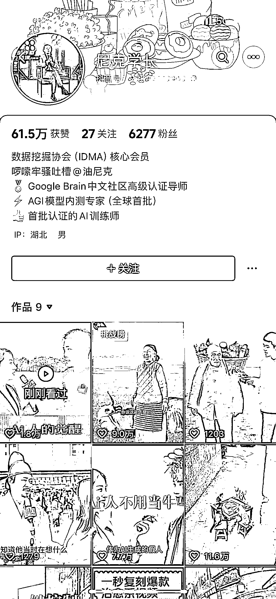
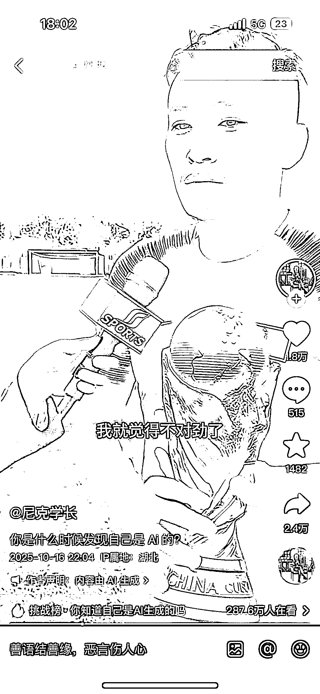
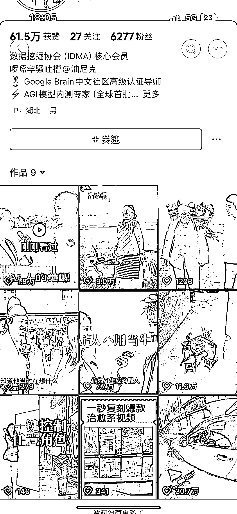
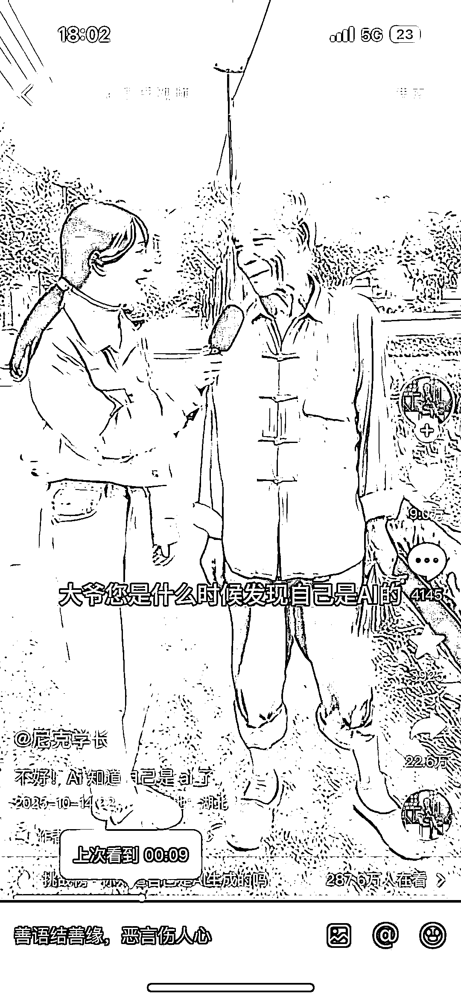
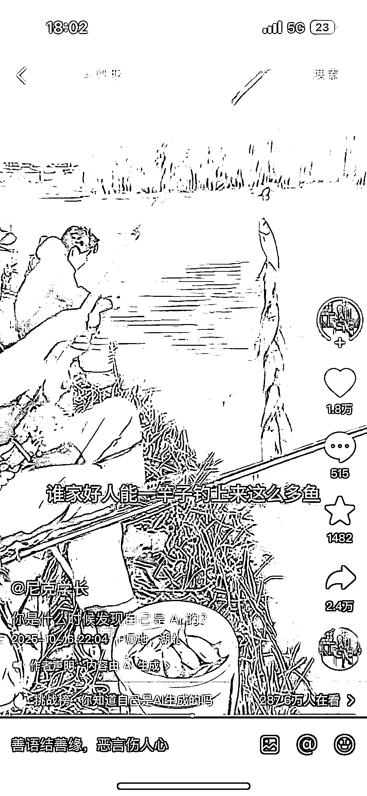

# sora2 创作 低粉账号连续产出 5 条万赞内容变现思路

> 原文：[`www.yuque.com/for_lazy/wind/ge5v7dmrq2m8glxp`](https://www.yuque.com/for_lazy/wind/ge5v7dmrq2m8glxp)

作者： 王小武

日期：2025-10-17

点赞数：**24**

* * *

正文：

用 Sora2，出各种采访视频，“您如何发现自己是 AI 的” 剧本脚本可以先用 Gemini 去进行分析找出同类型的爆款文案稿然后排列出分进脚本
将分进脚本直接给 Sora2 深圳出的视频，生成出的视频进行剪辑即可 变现方式可以进行收徒或者卖 Sora2 的邀请码，或者具体的课程
这个账号 6200 粉丝，连续做出 5 条万赞以上的内容，属于低粉爆款

* * *

评论区：

亦仁 : 感谢分享，已中标

* * *

公众号懒人搜索，[懒人专属群分享](https://lazybook.fun/#/blog/group)