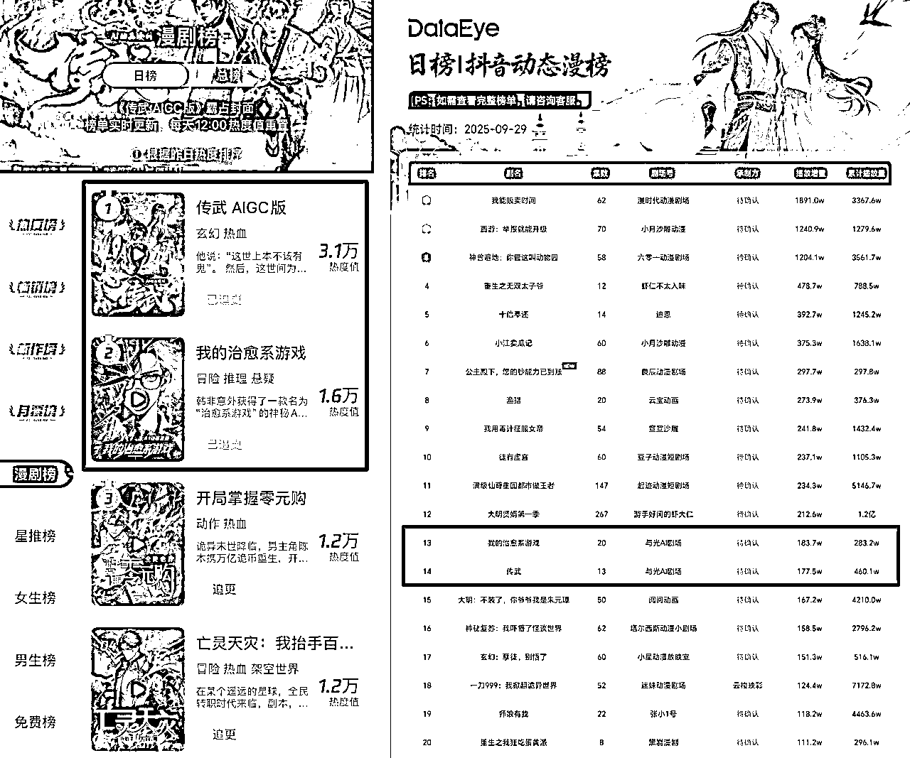

# 漫剧行业 8 月消耗环比上涨 174% 上新剧目接近 600 部

> 原文：[`www.yuque.com/for_lazy/wind/wk2t6yp3xc7zhehy`](https://www.yuque.com/for_lazy/wind/wk2t6yp3xc7zhehy)

作者： Miles

日期：2025-10-15

点赞数：**25**

* * *

正文：

今年的漫剧已经从“小众品类”跃升为内容行业新的增长点。 数据显示，漫剧行业 8 月整体消耗环比上涨 174%，当月上新剧目接近 600 部，环比+108%。
漫剧的实际发展比数据呈现的情况还要快，内容供给层面已经出现了路线分化——AI 既催生了量大管饱的产能革命，也开始为精品内容提供技术支撑。
9 月 26 日和 27 日先后上线的两部连载型的精品漫剧《传武》和《我的治愈系游戏》，均改编自阅文旗下 IP，纯 AI 制作，单个项目团队人数仅 7 人。其中，《传武》上线首周 12 集播放破 1000 万。
AI 则从产能和效率上大大降低了实现的门槛——国产精品 IP 内容正迎来历史性窗口，不仅是商业上的突围，还是真正走出国门的机会。随着 AI 技术迭代，漫剧行业将进入精品化量产新阶段。

* * *

评论区：

亦仁 : 感谢分享，已中标

* * *

公众号懒人搜索，[懒人专属群分享](https://lazybook.fun/#/blog/group)