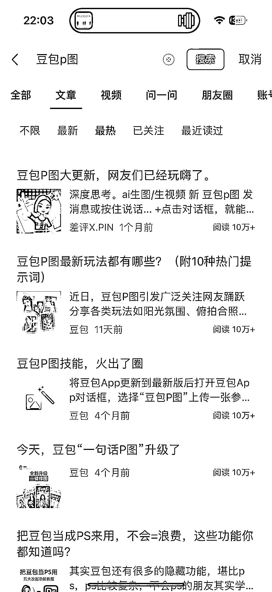

# 图片处理工具热点下的 C 端服务与培训赛道机遇

> 原文：[`www.yuque.com/for_lazy/wind/zgm10hdp5n22zvcx`](https://www.yuque.com/for_lazy/wind/zgm10hdp5n22zvcx)

作者： 摄影师海盐

日期：2025-10-11

点赞数：**31**

* * *

正文：

豆包 p 图真的太火了，不管是文章类还是视频类，很多的人都在用这个蹭热点。
可以做 c 端的接单服务，也可以做培训，最近有蛮多学员在跟我提这个培训的反馈，也让我引起了重视，后续搞起来。

* * *

评论区：

亦仁 : 感谢分享，已中标

* * *

公众号懒人搜索，[懒人专属群分享](https://lazybook.fun/#/blog/group)