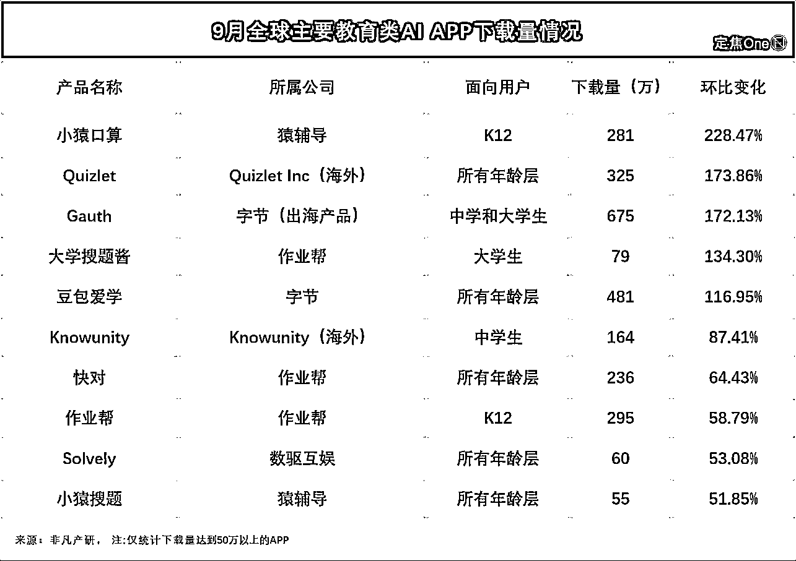
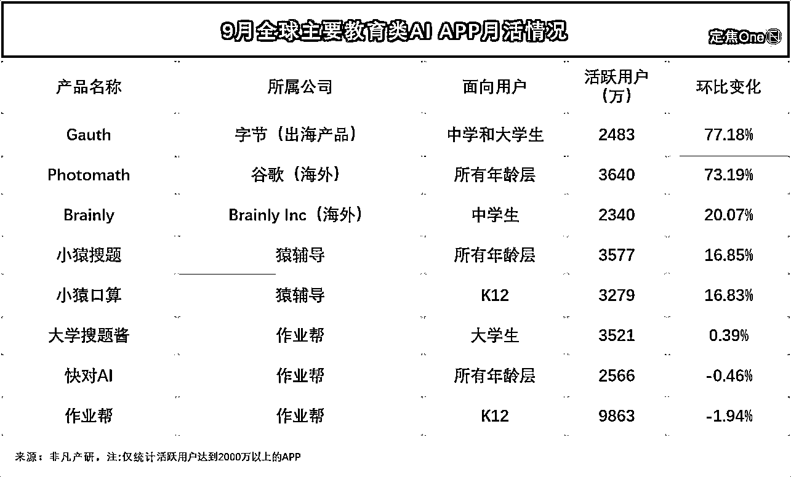

# 教育类 AI 应用 9 月崛起：月活与下载量上涨，部分产品涨幅近 1000%

> 原文：[`www.yuque.com/for_lazy/wind/ggk5pl3zgfkgo93v`](https://www.yuque.com/for_lazy/wind/ggk5pl3zgfkgo93v)

作者： Miles

日期：2025-10-17

点赞数：**27**

* * *

正文：

各大应用榜单公布的 9 月数据，揭示出一个 AI 应用新风向——教育类 AI 应用正加速崛起
教育类 AI 应用“起飞”，既受开学季自然流量带动，学生群体在作业批改、口算练习、难题搜索等需求显著提升，也受益于 AI 与教育行业的高度契合。
多家机构的数据显示，这一赛道的月活用户（MAU）与下载量双双上涨，部分产品涨幅甚至逼近 1000%。
好课帮助教育旗下的“光速写作”凭借场景定位与功能体验，月环比下载增速高达 926.59%，科大讯飞旗下的“E 听说中学”依托校园教学场景的产品设计，月活跃用户环比增速达 162.37%。
教育行业与 AI 的适配度很高，因为其范围相对明确（有具体学科和重要知识点划分）、结果可验证性强（有各种考试结果作为验证支撑），让 AI 应用的落地有了天然优势。

* * *

评论区：

亦仁 : 感谢分享，已中标

* * *

公众号懒人搜索，[懒人专属群分享](https://lazybook.fun/#/blog/group)