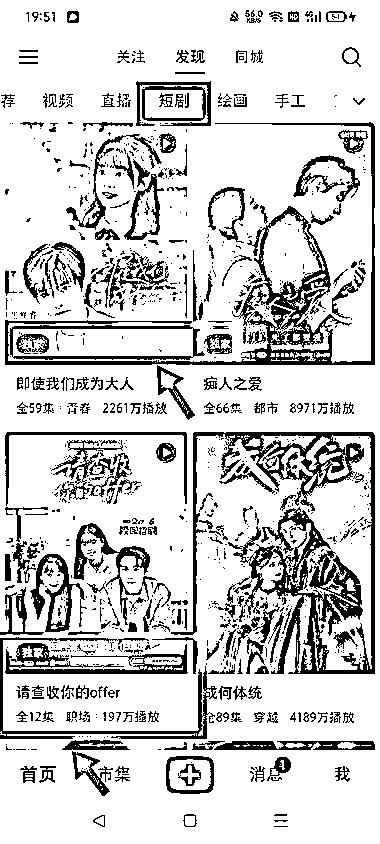
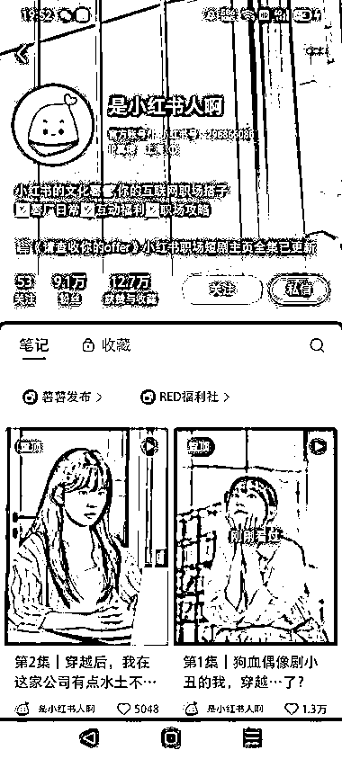
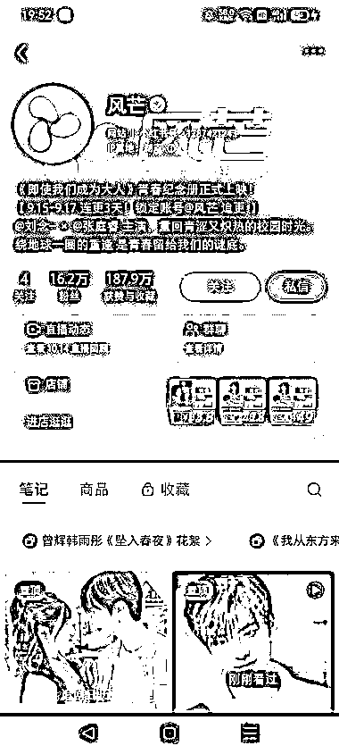

# 小红书短剧赛道：AI 工具助力内容自制与流量留存

> 原文：[`www.yuque.com/for_lazy/wind/losi5ff52eqyegrf`](https://www.yuque.com/for_lazy/wind/losi5ff52eqyegrf)

作者： 锦拾年（同路人）

日期：2025-10-17

点赞数：**29**

* * *

正文：

短剧独播标签，有含金量。 小红书平台，也有自制剧本，自产自销，持续留住人流量。 对 AI 工具熟练的圈友、团队，可以用 AI 制作短剧，充值的流水比小说赚佣还吃香。

* * *

评论区：

亦仁 : 感谢分享，已中标

* * *

公众号懒人搜索，[懒人专属群分享](https://lazybook.fun/#/blog/group)