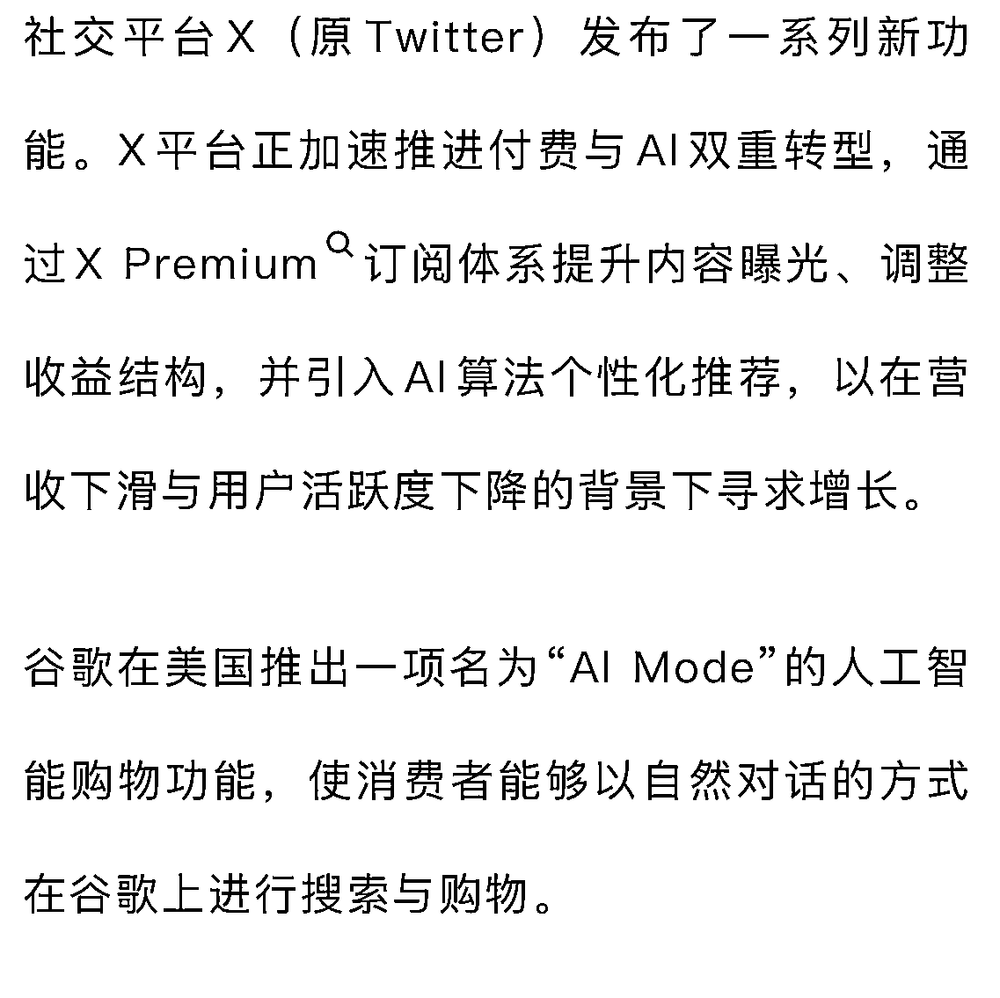

# 社交平台 X 加速付费与 AI 转型 借订阅体系与算法推荐寻求增长

> 原文：[`www.yuque.com/for_lazy/wind/mvov445ap3faaets`](https://www.yuque.com/for_lazy/wind/mvov445ap3faaets)

作者： Miles

日期：2025-10-18

点赞数：**19**

* * *

正文：

社交平台 X（原 Twitter）发布了一系列新功能。X 平台正加速推进付费与 AI 双重转型，通过 X
Premium 订阅体系提升内容曝光、调整收益结构，并引入 AI 算法个性化推荐，以在营收下滑与用户活跃度下降的背景下寻求增长。

* * *

评论区：

亦仁 : 感谢分享，已中标

* * *

公众号懒人搜索，[懒人专属群分享](https://lazybook.fun/#/blog/group)